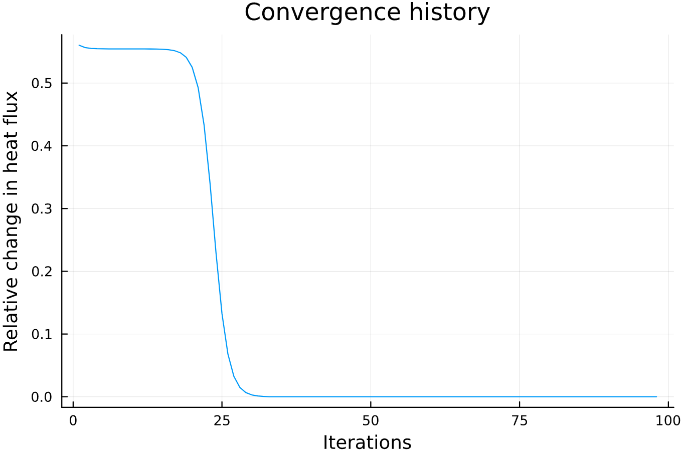
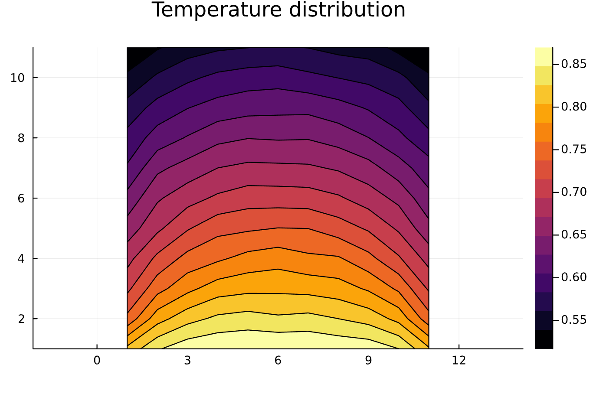
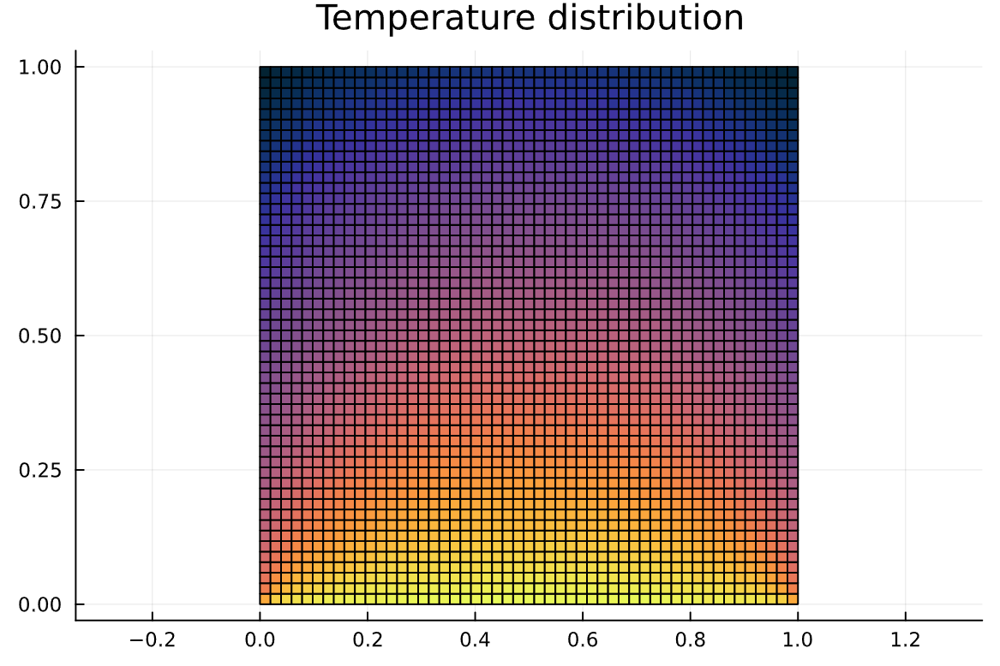
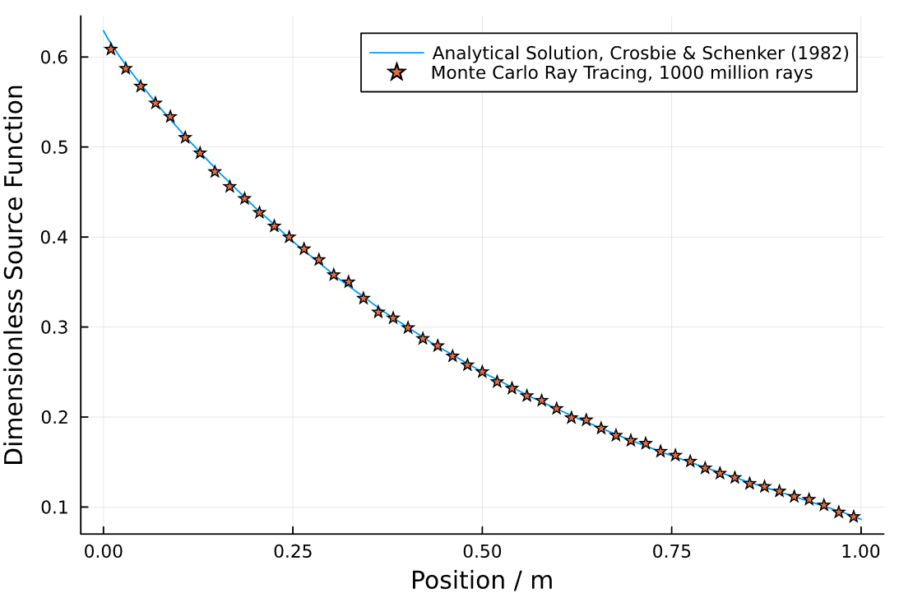
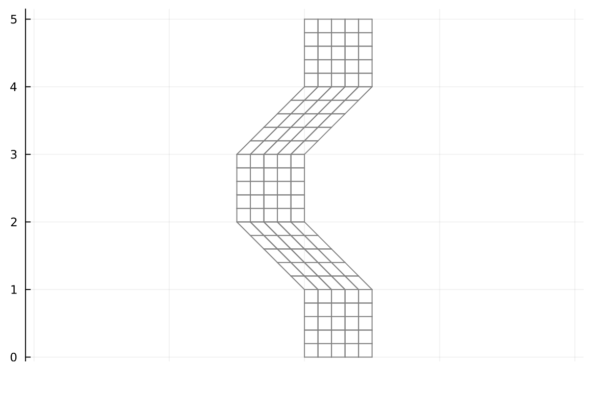

# RayTraceHeatTransfer.jl

[](https://travis-ci.com/NikoBiele/RayTraceHeatTransfer.jl)
[](https://codecov.io/gh/NikoBiele/RayTraceHeatTransfer.jl)

## Description

This repository can be used for radiation heat transfer calculations in an enclosure including a participating medium.
It contains a number of functions which collectively enables the user to ray trace a user defined geometry.
The result of the ray tracing are four 'exchange factor' matrices which together describe how the enclosure is radiatively connected.
Using the exchange factor matrices it is possible to quickly perform a heat transfer calculation on the entire enclosure, which would otherwise be computationally expensive to ray trace.
This package is limited to a uniformly distributed participating medium.
It is also limited to 2D enclosures (or more accurately: specular/mirrorlike front and back, since the sampled distributions are 3D).

## Features

- Define a custom geometry
- Ray trace the geometry rapidly
- 'Save' ray tracing result as Exchange Factor matrices (also as CSV-files)
- Quickly calculate heat transfer in the geometry using the Exchange Factors
- Avoid ray tracing the same geometry multiple times

## Installation

For now this repository must be downloaded from GitHub since it is not yet registered.

## Usage

### Generate geometry
The geometry is defined by a number of connected sub-enclosures.
The sub-enclosures are stacked on top of each other.
Here we define a 1x1 square (a single sub-enclosure), but the code should work for almost any user defined geometry.
We start by defining the bounding geometry.
```julia
yLayersHeight = [0.0, 1.0]; # create the y-positions or height-layers
N_subs = length(yLayersHeight)-1; # number of sub-enclosures (one for this example)
xLayersWidth = zeros(2, length(yLayersHeight)); # define the x-positions for each height layer
xLayersWidth[:,1] = [0.0, 1.0]; # bottom
xLayersWidth[:,2] = [0.0, 1.0]; # top
```
Now that our bounding geometry has been defined, it is time to mesh it. We mesh it twice. We need a coarse mesh since it is much more efficient to ray trace on a coarse mesh. But we also want our results to be fine-grained, so we map the absorption points to a fine mesh. We use the 'geometry' function to mesh the geometry. First the coarse geometry mesh:
```julia
displayGeometry = false; # do not show the geometry
# define the number of coarse splits in each enclosure
Nx_coarse = 3; # must be minimum 3
Ny_coarse = 2; # must be minimum 2
point1_coarse, point2_coarse, point3_coarse, point4_coarse, N_surfs_coarse, N_vols_coarse =
                        geometry(yLayersHeight,xLayersWidth,Ny_coarse,Nx_coarse,displayGeometry);
```
Next, the fine mesh (we split into 51x51):
```julia
# define the number of fine splits in each enclosure
Ndim = 51
Nx_fine = Ndim # must be minimum 3
Ny_fine = Ndim
point1_fine, point2_fine, point3_fine, point4_fine, N_surfs_fine, N_vols_fine =
                        geometry(yLayersHeight,xLayersWidth,Ny_fine,Nx_fine,displayGeometry);
```
Now our geometry is defined by the point-arrays.
### Monte Carlo ray tracing
Now that our geometry is in place, it is time to ray trace the domain. First we define the properties of our participating medium:
```julia
sigma_s = 0.0 # set scattering coefficient
kappa = 1.0 # set absorption coefficient
beta = sigma_s+kappa # extinction coefficient
omega = sigma_s/beta
```
Then we ray trace and save the results in exchange factor matrices:
```julia
displayWhileTracing = false # option to view the rays while they are traced (warning: very demanding)
N_rays_tot = 1e7; # total number of rays
# number of rays to trace from each zone
N_rays = trunc(Int, N_rays_tot/(Nx_fine*Ny_fine*N_subs+2*Nx_fine+2*Ny_fine))

# We execute the calculation in parallel on all available threads
if displayWhileTracing
    nthreads = 1
else
    nthreads = Threads.nthreads()
end

# SAMPLE SURFACES
FSS, FSG = sampleSurfaces(point1_coarse, point2_coarse, point3_coarse, point4_coarse, Ny_coarse, Nx_coarse,
                    N_surfs_fine,N_vols_fine,point1_fine, point2_fine, point3_fine, point4_fine, Ny_fine, Nx_fine,
                    beta,omega,N_rays,displayWhileTracing,nthreads,N_subs);

# SAMPLE VOLUMES
FGS, FGG = sampleVolumes(point1_coarse, point2_coarse,point3_coarse, point4_coarse, Ny_coarse, Nx_coarse,
                    N_surfs_fine,N_vols_fine,point1_fine, point2_fine,point3_fine, point4_fine, Ny_fine, Nx_fine,
                    beta,omega,N_rays,displayWhileTracing,nthreads,N_subs);
```
Now that our matrices are calculated we calculate the area and volume of all zones in the fine domain:
```julia
width = 1.0 # width of domain
Area, Volume = calculateAreaVolume(Nx_fine,Ny_fine,N_subs,width,point1_fine,point2_fine,point3_fine,point4_fine)
```
### Solve heat transfer problem for steady state temperature distribution
Now it is time to solve heat transfer problems on the domain defined by our geometry. First we fix the wall temperatures and set the initial gas temperatures. Then we solve for the steady state.
```julia
# define which wall temperatures are fixed
fixWalls = Vector{Bool}(undef, 4*Ndim)
fixWalls .= true # all are fixed
Tw_init = zeros(4*Ndim)
Tw_init[1:Ny_fine] .= 0.0
Tw_init[Ny_fine+1:2*Ny_fine] .= 0.0
Tw_init[2*Ny_fine+1:2*Ny_fine+Nx_fine] .= 1.0
Tw_init[2*Ny_fine+Nx_fine+1:2*Ny_fine+2*Nx_fine] .= 0.0
# gas initial temperatures
Tg_init = zeros(Ndim^2) .+ 100.0 # not fixed
# set the emissivities
epsw_vec = ones(4*Ndim)
# convergence criteria (which ever happens first)
maxIter = 100
relTol = 1e-3

Tw, Tg, iter_count, Grelabs = steadyStateRigorous(Nx_fine,Ny_fine,N_subs,Area,Volume,FSS,FSG,FGS,FGG,
                                                    fixWalls,epsw_vec,kappa,maxIter,relTol,
                                                    Tw_init,Tg_init)
```
Below is a plot of how our calculation has converged:

Now let's rearrange our gas volume temperature vector into the square of squares that it represents and plot them all:
```julia
Tg_matrix = plotTrapezoids(Nx_fine,Ny_fine,N_subs,Tg,point1_fine,point2_fine,point3_fine,point4_fine)
```
Giving:

As the last step, we also validate the code against the analytical solution of Crosbie and Schrenker (1982). Plotting the dimensionless source function for the centerline perpendicular to the incident radiation and comparing it to the analytical solution gives:

Which is not perfect, but still quite close considering that we only traced 10 million rays in total. Increasing the number of rays to 1 billion and repeating gives:


Decreasing the number of subdivisions would further increase the accuracy.

## Defining a custom geometry

To define a custom geometry, use different values in yLayersHeight and xLayersWidth:
```julia
# now we need to know the Coordinates of all the points in the enclosure
# set the height of the outer points (the y-coordinates)
displayGeometry = true;
yLayersHeight = [0.0, 1.0, 2.0, 3.0, 4.0, 5.0];
N_subs = length(yLayersHeight)-1; # number of sub-enclosures
xLayersWidth = zeros(2, length(yLayersHeight));
xLayersWidth[:,1] = [0.0, 1.0];
xLayersWidth[:,2] = [0.0, 1.0];
xLayersWidth[:,3] = [-1.0, 0.0];
xLayersWidth[:,4] = [-1.0, 0.0];
xLayersWidth[:,5] = [0.0, 1.0];
xLayersWidth[:,6] = [0.0, 1.0];
```
Which gives the geometry:
