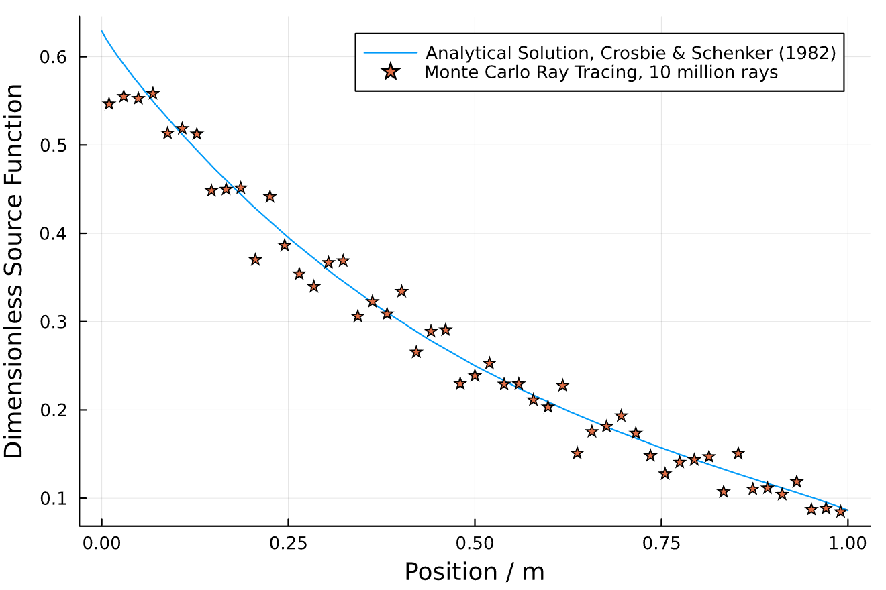
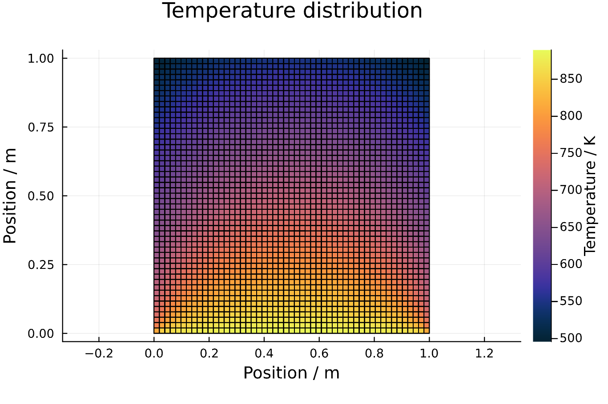

# RayTraceHeatTransfer.jl

[](https://travis-ci.com/NikoBiele/RayTraceHeatTransfer.jl)
[](https://codecov.io/gh/NikoBiele/RayTraceHeatTransfer.jl)

## Description

This repository can be used for radiation heat transfer calculations in an enclosure containing an absorbing-emitting-scattering participating medium.
It contains a number of functions which collectively enables the user to mesh and ray trace a user defined geometry.
The result of the ray tracing are four 'Exchange Factor' matrices which together describe how the enclosure is radiatively connected.
Using the exchange factor matrices it is possible to quickly perform a heat transfer calculation on the entire enclosure, which would otherwise be computationally expensive to ray trace.
This package is limited to a uniformly distributed participating medium.
It is also limited to 2D enclosures (or more accurately: specular/mirrorlike front and back, since the sampled distributions are 3D).

## Features

- Define and mesh a custom geometry
- Ray trace the geometry in parallel
- 'Save' ray tracing result as Exchange Factor matrices (also as CSV-files)
- Quickly calculate heat transfer in the geometry using the Exchange Factors
- Avoid ray tracing the same geometry multiple times

## Installation

To install the package, use the following command inside the Julia REPL:

```julia
using Pkg
Pkg.add("RayTraceHeatTransfer")
```

To load the package, use the command

```julia
using RayTraceHeatTransfer
```

## Usage

### Generate geometry

<p>We start by loading the package.<br>

```julia
using RayTraceHeatTransfer
```

<p>The geometry is built by a number of connected non-overlapping sub-enclosures stacked on top of each other.<br>
<p>The sub-enclosures are specified in a way so that the meshing can be done in a general way.<br>
<p>Here we define a 1x1 square (a single sub-enclosure), but the code should work for many different user defined geometries.<br>
<p>Next, we define the bounding geometry by specifying a number of heights (yLayersHeight) and two width coordinates per height (xLayersWidth).<br>
<p>This way of specifying the geometry is necessary for the meshing algorithm to work.<br>

```julia
yLayersHeight = [0.0, 1.0]; # create the y-positions or height-layers
xLayersWidth = zeros(2, length(yLayersHeight)); # define the x-positions for each height layer
xLayersWidth[:,1] = [0.0, 1.0]; # bottom
xLayersWidth[:,2] = [0.0, 1.0]; # top
```

<p>Now that our bounding geometry has been defined, it is time to mesh it.<br>
<p>We mesh it by specifying the number of splits in the x- and y-direction.<br>
<p>Then we generate the meshing automatically and plot it.<br>

```julia
# define the number of fine splits in each enclosure
Nx = 51
Ny = 51
# generate geometry
mesh1 = TracingMesh(Nx,Ny,xLayersWidth,yLayersHeight);
# plot the geometry
displayGeometry(mesh1)
```

<p>Viewing the result:<br>


<p>Now our geometry is defined by the 'mesh1' struct.<br>

### Monte Carlo ray tracing

<p>Now that our geometry is in place, it is time to ray trace the domain.<br>
<p>First we define the properties of our participating medium and store them in 'gas1':<br>

```julia
sigma_s = 0.0 # scattering coefficient
kappa = 1.0 # absorption coefficient
gas1 = GasProperties(sigma_s,kappa)
```

<p>Then we ray trace and save the results in exchange factor matrices:<br>

```julia
displayWhileTracing = false # option to view the rays while they are traced (warning: very demanding)
N_rays_tot = 10_000_000; # total number of rays
# number of rays to trace from each zone
N_rays = trunc(Int, N_rays_tot/(mesh1.N_surfs+mesh1.N_vols))
# We execute the calculation in parallel on all available threads
if displayWhileTracing
    nthreads = 1
else
    nthreads = Threads.nthreads()
end
# then we ray trace the domain to get the exchange factor matrices
FSS, FSG, FGS, FGG = sampleDomain(mesh1,gas1,N_rays,nthreads,displayWhileTracing)
```

### Solve heat transfer problem for steady state temperature distribution

<p>Now it is time to solve heat transfer problems on the domain defined by our geometry.<br>
<p>First we fix the wall temperatures and set the initial gas temperatures. Then we solve for the steady state.<br>

```julia
# define which wall temperatures are fixed
fixWalls = Vector{Bool}(undef, mesh1.N_surfs)
fixWalls .= true # all are fixed
# define temperature boundary conditions
Tw_hot = 1000.0
Tw_init = zeros(mesh1.N_surfs)
Tw_init[1:51] .= 0.0 # left wall
Tw_init[51+1:2*51] .= 0.0 # right wall
Tw_init[2*51+1:3*51] .= Tw_hot # bottom wall
Tw_init[3*51+1:end] .= 0.0 # top wall
# gas initial temperatures
Tg_init = zeros(mesh1.N_vols) .+ 100.0 # not fixed
# set the emissivities
epsw_vec = ones(mesh1.N_surfs)
# convergence criteria (which ever happens first)
maxIter = 100
relTol = 1e-3
# the outputs are the steady state temperature and flux distribution
Tw, Tg, Gw, Gg, iter_count, Grelabs = steadyStateRigorous(mesh1,FSS,FSG,FGS,FGG,
                                                        fixWalls,epsw_vec,kappa,maxIter,relTol,
                                                        Tw_init,Tg_init);
```

<p>Below is a plot of how our calculation has converged (plotting relative change in total heat flux as a function of iterations):<br>


<p>Now let's rearrange our gas volume temperature vector into the square of squares that it represents and plot them all:<br>

```julia
Tg_matrix = plotTemperatureField(mesh1,Tg) #,Tw); # optional wall temperatures
```

Giving:


<p>As the last step, we also validate the code against the analytical solution of Crosbie and Schrenker (1982).<br>
<p>Plotting the $(Tg/Tw_hot)^4$ for the centerline perpendicular to the incident radiation and comparing it to the analytical solution gives:<br>



<p>Which is not perfect, but still quite close considering that we only traced 10 million rays in total.<br>
<p>Increasing the number of rays to 1 billion and repeating gives:<br>




Decreasing the number of subdivisions would further increase the accuracy.

## Defining a custom geometry

To define a custom geometry, use different values in yLayersHeight and xLayersWidth:

```julia
# now we need to know the coordinates of all the points in the enclosure
# set the height of the outer points (the y-coordinates)
yLayersHeight = [0.0, 1.0, 2.0, 3.0, 4.0, 5.0];
N_subs = length(yLayersHeight)-1; # number of sub-enclosures
xLayersWidth = zeros(2, length(yLayersHeight));
xLayersWidth[:,1] = [0.0, 1.0];
xLayersWidth[:,2] = [0.0, 1.0];
xLayersWidth[:,3] = [-1.0, 0.0];
xLayersWidth[:,4] = [-1.0, 0.0];
xLayersWidth[:,5] = [0.0, 1.0];
xLayersWidth[:,6] = [0.0, 1.0];
Nx = 5
Ny = 5
# generate geometry
mesh1 = TracingMesh(Nx,Ny,xLayersWidth,yLayersHeight);
# plot the geometry
displayGeometry(mesh1)

```

Which gives the geometry:


<p>In general the numbering of the walls and volumes are defined as below.<br>
<p>This is important for defining wall properties and boundary conditions.<br>

Walls are numbered:
- First the left wall from bottom to top.
- Next the right wall from bottom to top.
- Third the bottom wall from left to right.
- Fourth the top wall from left to right.

Volumes are numbered:
- First the leftmost column of volumes, from bottom to top.
- Next go one step to the right and repeat, from bottom to top.
- Continue like this, until the last column which is the rightmost column, from bottom to top.