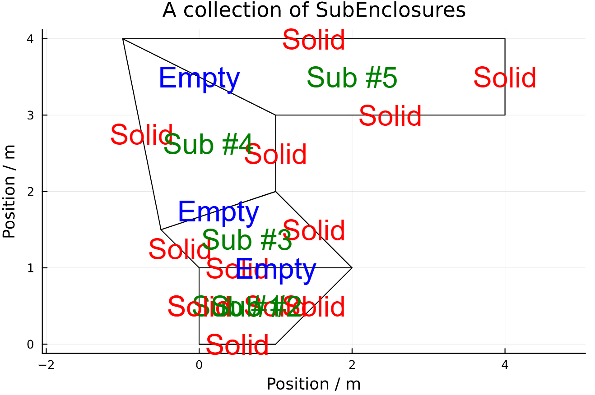

### Generate and mesh geometry

In this section it will be shown how to build geometries using this package.

We start by importing the package

```julia
using RayTraceHeatTransfer
```

The geometry is built by a number of non-overlapping convex "SubEnclosures".
The "SubEnclosures" always consist of four bounding points and they should always be convex (no internal angles above 180°).
Non-convex shapes should be split into smaller convex "SubEnclosures".
The reason that the "SubEnclosures" should be convex is that it makes the ray tracing more efficient.
Here we define a 1x1 square (a single sub-enclosure).

We start by defining an empty vector of "SubEnclosures".

```julia
subs = SubEnclosure[]
```

Now we can make one SubEnclosure at a time and push it into the vector.
When specifying a SubEnclosure the inputs are as follows:
The first four inputs are the bounding points, going in the counter clockwise direction.
The next four inputs specifies whether the walls are solid or empty, which is important when connecting more SubEnclosures.
The outer wall should always be solid for the ray tracing to work.
The first wall is between point1 and point2 and so on, and the last wall is between point4 and point1.

```julia
sub1 = SubEnclosure([0.0, 0.0],[1.0, 0.0],[1.0, 1.0],[0.0, 1.0],true,true,true,true)
push!(subs, sub1)
```

After adding a sub it is recommended to always ensure that it was correctly added.
This can be done using the 'displayGeometry' function, which plots any number of SubEnclosures stored in a vector.

```julia
displayGeometry(subs)
```


If the last added SubEnclosure is not satisfactory we can remove it and try again.

```julia
pop!(subs)
```

Then we can keep adding SubEnclosures to our geometry (and popping if we're not satisfied).
It is recommended to display the geometry after each added subEnclosure.

```julia
sub1 = SubEnclosure([0.0, 0.0],[1.0, 0.0],[2.0, 1.0],[0.0, 1.0],true,true,false,true)
push!(subs, sub1)
displayGeometry(subs)

sub2 = SubEnclosure([0.0, 1.0],[2.0, 1.0],[1.0, 2.0],[-0.5, 1.5],false,true,false,true)
push!(subs, sub2)
displayGeometry(subs)

sub3 = SubEnclosure([-0.5, 1.5],[1.0, 2.0],[1.0, 3.0],[-1.0, 4.0],false,true,false,true)
push!(subs, sub3)
displayGeometry(subs)

sub4 = SubEnclosure([-1.0, 4.0],[1.0, 3.0],[4.0, 3.0],[4.0, 4.0],false,true,true,true)
push!(subs, sub4)
displayGeometry(subs)
```

Viewing the final result.
Notice that the subEnclosures are numbered incrementally and internal faces are shown as 'empty' while the outer surfaces are 'solid'.
This will be important for defining boundary conditions when calculating heat transfer.



When we are finally satisfied with our geometry we can move on to meshing it.
The fineness of the meshing decides the resolution of or our heat transfer calculations.
We specifiy the number of splits in each SubEnclosure.
In this case each SubEnclosure will be split into 11x11 cells.

```julia
Ndim = 11
```

Now we are ready to mesh the geometry.
This is achieved by creating an instance of the RayTracingMesh type.
The function which generates this type takes as input a vector of SubEnclosures and the number of splits.

```julia
mesh1 = RayTracingMesh(subs,Ndim);
displayMesh(mesh1)
```


Now that the geometry has been meshed we're ready to ray trace it.