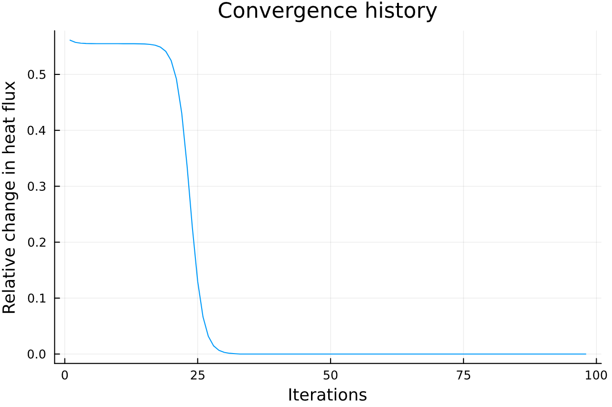
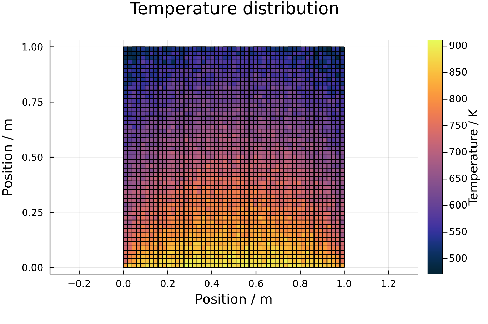
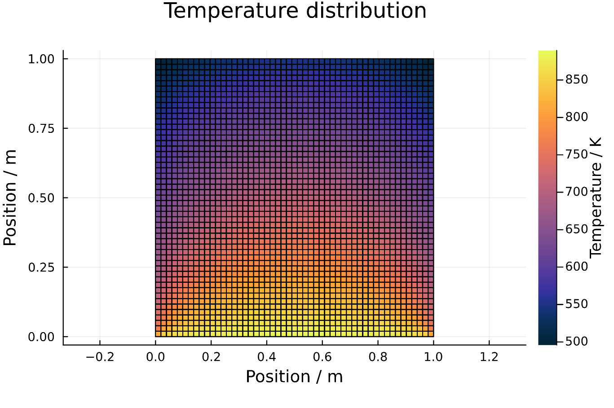
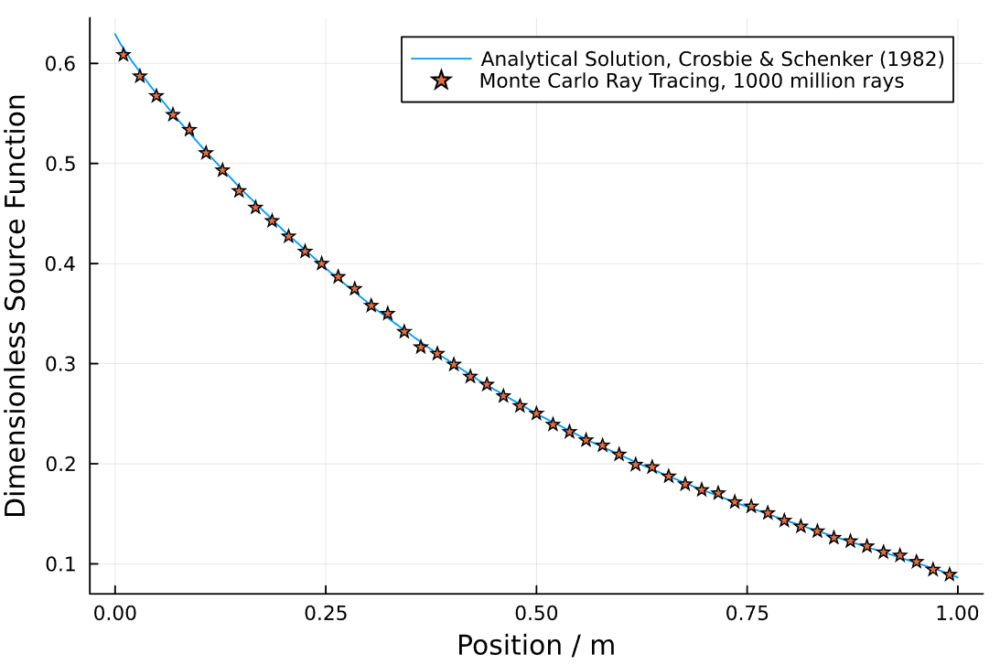

## Code validation

This section will compare results generated by this package with an analytical solution in order to validate the correctness of the code.
This section essentially goes through all of the steps performed by the function "validCrosbieSchrenker".
We start by loading the package.

```julia
using RayTraceHeatTransfer
```

The geometry is built by a number of non-overlapping sub-enclosures.
The sub-enclosures are specified like this so that the meshing and ray tracing can be done in a general way.
Here we define a 1x1 square (a single sub-enclosure).

```julia
# now we need to know the Coordinates of all the points in the enclosure
# define a vector of SubEnclosures
subs = SubEnclosure[]

# make a SubEnclosure and push it into the vector
sub1 = SubEnclosure([0.0, 0.0],[1.0, 0.0],[1.0, 1.0],[0.0, 1.0],true,true,true,true)
push!(subs, sub1)
```

Now that our bounding geometry has been defined, it is time to mesh it.
We mesh it by specifying the number of splits in the x- and y-direction.
Then we generate the meshing automatically and plot it.

```julia
# generate mesh
Ndim = 51
mesh1 = RayTracingMesh(subs,Ndim);
# plot the geometry
displayMesh(mesh1)
```

Viewing the result:


Now our geometry is defined by the 'mesh1' struct.

### Monte Carlo ray tracing

Now that our geometry is in place, it is time to ray trace the domain.
First we define the properties of our participating medium and store them in 'gas1':

```julia
sigma_s = 0.0 # scattering coefficient
kappa = 1.0 # absorption coefficient
gas1 = GasProperties(sigma_s,kappa)
```

Then we ray trace and save the results in exchange factor matrices:

```julia
displayWhileTracing = false # option to view the rays while they are traced (warning: very demanding)
N_rays_tot = 10_000_000; # total number of rays
# number of rays to trace from each zone
N_rays = trunc(Int, N_rays_tot/(mesh1.N_surfs+mesh1.N_vols))

# We execute the calculation in parallel on all available threads
nthreads = Threads.nthreads()

# then we ray trace the domain to get the exchange factor matrices
FSS, FSG, FGS, FGG = sampleDomain(mesh1,gas1,N_rays,nthreads,displayWhileTracing)
```

### Solve heat transfer problem for steady state temperature distribution

Now it is time to solve heat transfer problems on the domain defined by our geometry.
First we fix the wall temperatures and set the initial gas temperatures. Then we solve for the steady state.

```julia
# define boundary conditions

# define which wall temperatures are fixed
# we only need to set those which should be fixed
# those which are set to negative will be interpreted as unknown
Tw_hot = 1000.0
qw_in = zeros(mesh1.N_subs,4)

# set the emissivities
epsw_in = ones(mesh1.N_subs,4)

# gas initial temperatures, set temperatures on a sub enclosure basis
Tg_in = zeros(mesh1.N_subs) .- 1 # unknown gas temperature
qg_in = zeros(mesh1.N_subs) # radiative equilibrium

# set the emissivities
# convergence criteria (which ever happens first)
maxIter = 100
relTol = 1e-3

# test bottom wall emissions
Tw_in = zeros(mesh1.N_subs,4)
Tw_in[1,1] = Tw_hot # bottom wall
println("Calculating steady state temperature distribution (bottom wall emitter).")
Tw, Tg, Gw, Gg, iter_count, Grelabs = steadyStateRigorous(mesh1,FSS,FSG,FGS,FGG,
                                                    epsw_in,gas1,maxIter,relTol,
                                                    Tw_in,Tg_in,qw_in,qg_in);
Tg_matrix = plotTemperatureField(mesh1,Tg); #,Tw); # optional wall temperatures
Tg_bottom = dropdims(Tg_matrix, dims=1)
```

Below is a plot of how our calculation has converged (plotting relative change in total heat flux as a function of iterations):



Now let's rearrange our gas volume temperature vector into the square of squares that it represents and plot them all:

```julia
Tg_matrix = plotTemperatureField(mesh1,Tg) #,Tw); # optional wall temperatures
```

Giving:



As the last step, we also validate the code against the analytical solution of Crosbie and Schrenker (1982).
Plotting the (Tg/Tw)^4 for the centerline perpendicular to the incident radiation and comparing it to the analytical solution gives:


Which is not perfect, but still quite close considering that we only traced 10 million rays in total.
Increasing the number of rays to 1 billion and repeating gives:





Decreasing the number of subdivisions (Ndim) would further increase the accuracy.
