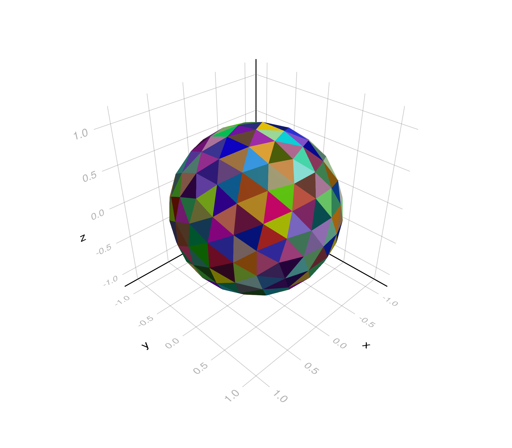

# RayTraceHeatTransfer.jl

A Julia package for radiative heat transfer using Monte Carlo ray tracing and the Graph Equilibrium Radiative Transfer (GERT, see [Bielefeld, 2025](https://arxiv.org/abs/2512.22157)) methods. Solves grey and spectral radiative equilibrium in 2D participating media and 3D surface enclosures, with exchange factor smoothing for machine precision reciprocity and energy-conserving solutions.

## Features

- **2D participating media** — absorbing, emitting, and scattering gases with enclosing surfaces
- **3D surface enclosures** — transparent media with analytical view factors (Narayanaswamy 2015)
- **Grey and spectral** — wavelength-independent or band-resolved radiation with automatic solver selection
- **Exchange factor smoothing** — iterative reciprocity enforcement for machine-precision reciprocity and energy conservation
- **Callable domains** — `mesh(N_rays; method=:exchange)` runs ray tracing directly on the domain object
- **Plotting extensions** — GLMakie and Plots backends for mesh and field visualisation

## Installation

```julia
using Pkg
Pkg.add("RayTraceHeatTransfer")
```

For plotting, also install a Makie backend and/or Plots:

```julia
Pkg.add("GLMakie")   # for plotMesh (2D and 3D) and plotField (3D)
Pkg.add("Plots")     # for plotField (2D)
```

---

## Example 1 — 2D Grey Participating Medium

This example solves radiative equilibrium in a 1 × 1 m square enclosure filled with an absorbing gas (absorption coefficient: κ = 1 m⁻¹, no scattering: σₛ = 0 m⁻¹). The bottom wall is held at 1000 K and all other walls are at 0 K; all surfaces are black (ε = 1). The gas temperature field is found by solving the GERT system after computing exchange factors with Monte Carlo ray tracing.

### Step 1: Define the geometry and mesh

```julia
using RayTraceHeatTransfer
using GeometryBasics, StaticArrays

vertices = SVector(
    Point2(0.0, 0.0),
    Point2(1.0, 0.0),
    Point2(1.0, 1.0),
    Point2(0.0, 1.0)
)
solidWalls = SVector(true, true, true, true) # all walls impenetrable by radiation

face = PolyVolume2D{Float64}(vertices, solidWalls, 1, 1.0, 0.0);  # κ=1, σₛ=0, for the gas volume

face.T_in_w  = [1000.0, 0.0, 0.0, 0.0]   # bottom hot, rest cold
face.epsilon = [1.0, 1.0, 1.0, 1.0]       # black walls
face.T_in_g  = -1.0                         # unknown (solve for this)
face.q_in_g  = 0.0                          # radiative equilibrium

Ndim = 11  # 11 × 11 elements
mesh = RayTracingDomain2D([face], [(Ndim, Ndim)]); # mesh the domain
```

### Understanding the mesh numbering

Each gas volume and solid wall surface in the mesh receives a global index that corresponds to a row/column in the exchange factor matrix. Use `plotMesh` with the `volumeNumbers` and `wallNumbers` keyword arguments to visualise specific indices:

```julia
using GLMakie

fig = Figure(size = (700, 700))
ax  = Axis(fig[1, 1], aspect = DataAspect(), xlabel = "x (m)", ylabel = "y (m)",
           title = "Mesh with element numbering (11 × 11)")

# Show volume indices along the vertical centerline
center_col = div(Ndim + 1, 2)
centerline_vols = [center_col + (row - 1) * Ndim for row in 1:Ndim]
bottom_wall_indices = [1; collect(3:Ndim+1)]

plotMesh(ax, mesh)
plotMesh(ax, mesh; volumeNumbers = centerline_vols)
plotMesh(ax, mesh; wallNumbers = bottom_wall_indices)

fig
save("fig/mesh_numbering.png", fig, px_per_unit=3)
```


Volume elements are labelled **g*i*** and wall surfaces **w*i***. The indices shown here are the same indices used in the exchange factor matrix `mesh.F_smooth` and in the system matrices returned by the `buildSystemMatrices!` function (used internally). The system matrices row/column numberings always start with the surfaces, then volumes.

### Step 2: Ray trace and solve

```julia
mesh(10_000_000; method = :exchange)         # Monte Carlo ray tracing
solveEquilibrium!(mesh, mesh.F_smooth)       # solve GERT system
```

### Step 3: Validate against Crosbie & Schrenker (1984)

The analytical solution for the dimensionless source function S(τ) = (T/T_hot)⁴ along the centerline of this problem is given by Crosbie & Schrenker (1984). Extracting the centerline temperatures from the solved mesh and comparing:

```julia
using Plots

# --- Left panel: solution temperature field via plotField ---
p1 = plotField(mesh; field = :T)

# Extract centerline temperatures
all_temps  = [ff.T_g for ff in mesh.fine_mesh[1]]
Tg_matrix  = reshape(all_temps, Ndim, Ndim)
centerline = Tg_matrix[div(Ndim + 1, 2), :]

# Dimensionless source function
S_computed = (centerline ./ 1000.0) .^ 4
tau_centers = range(1 / (2Ndim), 1 - 1 / (2Ndim), length = Ndim)

# --- Crosbie & Schrenker (1984) analytical reference ---
tau_ref = [0.0, 0.00611, 0.02037, 0.04251, 0.07216, 0.10884, 0.15194,
           0.20076, 0.25449, 0.31225, 0.37309, 0.43602, 0.50000, 0.56398,
           0.62691, 0.68775, 0.74551, 0.79924, 0.84806, 0.89116, 0.92784,
           0.95749, 0.97963, 0.99390, 1.00000]

S_ref  = [0.6293, 0.6198, 0.6017, 0.5767, 0.5460, 0.5108, 0.4724,
          0.4323, 0.3919, 0.3525, 0.3153, 0.2810, 0.2500, 0.2224,
          0.1981, 0.1768, 0.1584, 0.1424, 0.1287, 0.1171, 0.1073,
          0.0992, 0.0930, 0.0885, 0.0863]

# --- Bottom panel: centerline validation ---
p2 = Plots.plot(tau_ref, S_ref,
    linewidth = 2, color = :black, label = "Analytical (C & S)",
    xlabel = "Optical depth τ",
    ylabel = "Dimensionless source function S(τ)",
    title = "Centerline validation",
    legend = :topright,
    dpi = 1000,
    guidefontsize = 12,
    tickfontsize = 10)

Plots.scatter!(p2, tau_centers, S_computed,
    color = :dodgerblue, markersize = 5, label = "RayTraceHeatTransfer.jl")
Plots.plot!(p2, top_margin=8Plots.mm, bottom_margin=8Plots.mm)

# --- Combined figure ---
Plots.plot!(p1, guidefontsize=12, tickfontsize=10, 
            left_margin=5Plots.mm, right_margin=10Plots.mm)
p = Plots.plot(p1, p2, layout = (2,1), size = (600, 800), dpi=1000)
display(p)
Plots.savefig(p, "fig/validation_2d_grey.png")
```


The top panel shows the 2D temperature field; the bottom panel compares the computed centerline source function (blue dots) with the analytical reference (black line). Agreement is excellent for 10⁷ rays on an 11 × 11 mesh.

### References

> Crosbie, A. L. & Schrenker, R. G. (1984). "Radiative transfer in a two-dimensional rectangular medium exposed to diffuse radiation." *Journal of Quantitative Spectroscopy and Radiative Transfer*, 31(4), 339–372.

> Bielefeld, N. M. (2025). "A Radiation Exchange Factor Transformation with Proven Convergence, Non-Negativity, and Energy Conservation" *arXiv preprint*, [arXiv:2512.22157](https://arxiv.org/abs/2512.22157).

---

## Example 2 — Spectral Greenhouse Atmosphere

This example models a simplified planetary atmosphere to demonstrate the spectral solver. The atmosphere is transparent in the visible and opaque in the infrared, producing a greenhouse effect: solar radiation penetrates to the surface, while thermal emission from the warm surface is trapped by the absorbing gas. The equilibrium surface temperature, which is not prescribed, emerges far above the value for a transparent atmosphere.

The geometry is a vertical stack of 20 sub-enclosures representing atmospheric layers, each with spectrally distinct absorption. A thin volume at the top emits at solar temperature, acting as the radiation source. The domain is wide relative to its height, approximating a 1D atmosphere.

### Step 1: Define the atmosphere

```julia
using RayTraceHeatTransfer
using GeometryBasics, StaticArrays

n_bins       = 40            # spectral bins
atm_height   = 100_000.0     # atmosphere height (m)
L            = atm_height    # normalization length
N_layers     = 20            # atmospheric layers
width        = 100.0         # normalized width (wide domain ≈ 1D)
scale_height = 15_900.0      # density scale height (m)
T_sun        = 5800.0        # solar temperature (K)
q_solar      = 2 * 2600.0    # isotropic solar flux (both up and down) (W/m²)
κ_vis        = 0.01          # visible absorption coefficient
κ_ir         = 100.0         # infrared absorption coefficient
λ_min        = 1e-9          # minimum wavelength (m)
λ_max        = 1.0           # maximum wavelength (m)
stretch      = 5.0           # spatial layer clustering near surface
```

The spectral range spans from 1 nm to 1 m; wide enough to capture the full Planck distribution at all temperatures in the problem. An insufficient spectral range forces energy into edge bins and degrades the solution.

### Step 2: Build the spectral grid and layer geometry

```julia
# Spectral grid (log-spaced in wavelength)
λ_edges  = 10 .^ range(log10(λ_min), log10(λ_max), length = n_bins + 1)
λ_center = [sqrt(λ_edges[b] * λ_edges[b+1]) for b in 1:n_bins]

# Log-spaced spatial layers: thin near the surface where temperature
# gradients are steepest, thick higher up where the atmosphere thins
layer_param      = range(0.0, 1.0, length = N_layers + 1)
layer_edges_norm = [(exp(stretch * t) - 1) / (exp(stretch) - 1) for t in layer_param]

# Solar volume: a thin layer at the top whose emission matches the desired
# irradiance. This avoids modifying the solver for spectral boundary fluxes.
sun_layer_height = 1000.0     # 1 km thick
κ_sun = q_solar * L / (4 * 5.670374419e-8 * T_sun^4 * sun_layer_height) # tuned absorption coefficient (emission)

normalized_scale_height = scale_height / L
```

### Step 3: Assemble the atmospheric layers

Each layer has a spectrally distinct absorption coefficient: a sigmoid transition around λ = 4 μm separates the transparent visible window (κ ≈ 0.01) from the opaque infrared (κ ≈ 100), scaled by the local atmospheric density. This spectral asymmetry is the mechanism behind the greenhouse effect.

```julia
faces     = PolyVolume2D{Float64}[]
divisions = Tuple{Int,Int}[]

for j in 1:N_layers
    y_bot = layer_edges_norm[j]
    y_top = layer_edges_norm[j + 1]
    y_mid = (y_bot + y_top) / 2

    verts = SVector(
        Point2(0.0, y_bot), Point2(width, y_bot),
        Point2(width, y_top), Point2(0.0, y_top)
    )
    solidwalls = SVector((j == 1), true, false, true) # transparent horizontal walls

    # Exponential density decay
    ρ = exp(-y_mid / normalized_scale_height)

    # Spectral absorption: sigmoid from visible-transparent to IR-opaque
    sigmoid = [(1 / (1 + (4e-6 / λ_center[b])^6)) for b in 1:n_bins]
    layer_κ = [ρ * (κ_ir * sigmoid[b] + κ_vis * (1 - sigmoid[b]))
               for b in 1:n_bins]

    face = PolyVolume2D{Float64}(verts, solidwalls, n_bins, 1.0, 0.0)
    face.kappa_g   = layer_κ # local spectral absorption coefficients
    face.sigma_s_g = fill(0.0, n_bins) # local spectral scattering coefficients
    face.epsilon   = [fill(1.0, n_bins) for _ in 1:4]
    face.T_in_g    = -1.0       # solve for gas temperature
    face.q_in_g    = 0.0        # radiative equilibrium

    if j == 1
        face.T_in_w = [-1.0, 0.0, 0.0, 0.0]  # free surface, cold sides
    else
        face.T_in_w = [0.0, 0.0, 0.0, 0.0]   # cold boundaries
    end
    face.q_in_w = [0.0, 0.0, 0.0, 0.0] # source flux

    push!(faces, face)
    push!(divisions, (1, 2)) # each layer must be divided for the ray tracer to work
end
```

In general, to solve for temperature, set `T=-1`. Then the solver uses the prescribed flux to solve for `T`. Any non-negative prescribed `T` will remain fixed, then the solved determines the source flux `q`. At least one `T` in the domain must be fixed.

### Step 4: Add the solar source and build the mesh

```julia
sun_h_norm = sun_layer_height / L
verts_sun  = SVector(
    Point2(0.0, 1.0), Point2(width, 1.0),
    Point2(width, 1.0 + sun_h_norm), Point2(0.0, 1.0 + sun_h_norm)
)

face_sun = PolyVolume2D{Float64}(
    verts_sun, SVector(false, true, true, true), n_bins, κ_sun, 0.0);
face_sun.kappa_g   = fill(κ_sun, n_bins) # spectrally uniform absorption coefficient
face_sun.sigma_s_g = fill(0.0, n_bins) # local spectral scattering coefficients
face_sun.epsilon   = [fill(1.0, n_bins) for _ in 1:4] # black space (fully absorbing)
face_sun.T_in_g    = T_sun # prescribed solar temperature
face_sun.q_in_g    = 0.0 # uses temperature
face_sun.T_in_w    = [0.0, 0.0, 0.0, 0.0] # cold space behind the sun (fully absorbing)
face_sun.q_in_w    = [0.0, 0.0, 0.0, 0.0] # uses temperature

push!(faces, face_sun);
push!(divisions, (1, 2)); # each layer must be divided for the ray tracer to work

mesh = RayTracingDomain2D(faces, divisions); # mesh the domain
mesh.wavelength_band_limits = λ_edges # spectral limits
```

### Step 5: Ray trace and solve

```julia
mesh(2_000_000; method = :exchange)
solveEquilibrium!(mesh, mesh.F_smooth;
    max_iterations = 10_000, convergence_tol = 1e-12)
```

Ray tracing is performed independently for each spectral bin, computing separate exchange factor matrices that represent the wavelength-dependent extinction. The spectral equilibrium solver then iterates to find the temperature distribution that simultaneously satisfies energy conservation across all bins.

### Step 6: Extract and plot the temperature profile

```julia
using Plots

gas_temps = Float64[]
altitudes = Float64[]

push!(gas_temps, mesh.fine_mesh[1][1].T_w[1])   # surface temperature
push!(altitudes, 0.0)

for j in 1:N_layers
    for k in 1:2
        push!(gas_temps, mesh.fine_mesh[j][k].T_g) # gas temperatures
        push!(altitudes, mesh.fine_mesh[j][k].midPoint[2] * L)
    end
end

p = Plots.plot(gas_temps, altitudes ./ 1000,
    linewidth = 2, color = :black, marker = :circle, markersize = 3,
    ylabel = "Altitude (km)", xlabel = "Temperature (K)",
    title = "Atmospheric temperature profile\n(spectral greenhouse effect)",
    legend = false, dpi = 500,
    guidefontsize = 12, tickfontsize = 10,
    left_margin = 5Plots.mm, bottom_margin = 10Plots.mm,
    right_margin = 15Plots.mm)

savefig(p, "fig/spectral_greenhouse.png")
display(p)
```


The surface temperature emerges well above the bare blackbody equilibrium; a direct consequence of the spectral asymmetry between incoming (visible) and outgoing (infrared) radiation. Temperature decreases monotonically with altitude as the atmosphere thins and becomes transparent.

> **Note:** This is a simplified radiative equilibrium model without convection, latent heat, or detailed molecular absorption bands. Nevertheless, it captures the essential greenhouse mechanism from first principles: the spectral solver enforces energy conservation across the full spectrum to machine precision, and the temperature profile emerges purely from the exchange of radiation between layers.

The spectral solver is an unpublished extension of the grey GERT method described in [Bielefeld (2025)](https://arxiv.org/abs/2512.22157). It solves the coupled spectral equilibrium by iterating over Planck-weighted band contributions while preserving the exchange factor framework and its energy conservation guarantees.

---

## Example 3 — 3D Surface Enclosure

This example solves radiative equilibrium in a unit cube with transparent (non-participating) media. Two opposing faces have prescribed temperatures (1000 K and 0 K); the four side walls are in radiative equilibrium (unknown temperature, zero net heat flux). All surfaces are black (ε = 1). View factors are computed analytically using the method of Narayanaswamy (2015), which means no ray tracing is needed.

### Step 1: Define the cube geometry

```julia
using RayTraceHeatTransfer
using GLMakie

# Cube vertices
points = [
    0.0 0.0 0.0;  # 1
    0.0 0.0 1.0;  # 2
    0.0 1.0 0.0;  # 3
    0.0 1.0 1.0;  # 4
    1.0 0.0 0.0;  # 5
    1.0 0.0 1.0;  # 6
    1.0 1.0 0.0;  # 7
    1.0 1.0 1.0   # 8
]

# Six faces (right-hand rule for outward normals)
faces = [
    1 2 4 3;  # Face 1 (x = 0) — hot
    5 6 8 7;  # Face 2 (x = 1) — cold
    1 5 7 3;  # Face 3 (z = 0)
    2 6 8 4;  # Face 4 (z = 1)
    3 4 8 7;  # Face 5 (y = 1)
    1 2 6 5   # Face 6 (y = 0)
]
```

### Step 2: Set boundary conditions and mesh the domain

```julia
Ndim = 11  # 11 × 11 subdivisions per face

epsilon = ones(size(faces, 1))                     # black surfaces
q_in_w  = [0.0, 0.0, 0.0, 0.0, 0.0, 0.0]           # zero net heat flux on sides
T_in_w  = [1000.0, 0.0, -1.0, -1.0, -1.0, -1.0]    # hot, cold, four unknown

domain3D = ViewFactorDomain3D(points, faces, Ndim, q_in_w, T_in_w, epsilon); # mesh domain
```
Faces 1 and 2 are the hot and cold walls at opposing ends of the cube. The four side faces have `T_in_w = -1.0` (unknown) and `q_in_w = 0.0` (radiative equilibrium), so their temperature distributions emerge from the solution.

### Step 3: visualize the domain for validation

```julia
fig = Figure(size = (800, 700))
ax  = LScene(fig[1, 1], scenekw = (camera = cam3d!, show_axis = true))
plotMesh(ax, domain3D)
```

### Step 4: Calculate view factors

Calculate analytical view factors directly on the mesh object (requires a convex domain):

```julia
domain3D(; parallel=true, tol=10*eps(Float64))
```

### Step 5: Solve and visualise

```julia
solveEquilibrium!(domain3D, domain3D.F_smooth)

fig = Figure(size = (800, 700))
ax  = LScene(fig[1, 1], scenekw = (camera = cam3d!, show_axis = true))
plotField(ax, domain3D; field = :T)
fig
save("fig/3d_cube_temperature.png", fig, px_per_unit = 3)
```


The temperature field shows a smooth gradient from the hot face (1000 K) to the cold face (0 K), with the side walls at intermediate temperatures determined by radiative equilibrium. The analytical view factors ensure exact geometric accuracy without statistical noise.

### Reference

> Narayanaswamy, A. (2015). "An analytic expression for radiation view factor between two arbitrarily oriented planar polygons." *International Journal of Heat and Mass Transfer*, 91, 841–847.

---

## Example 4 — Triangulated Icosphere

This example extends Example 3 from axis-aligned quads to an arbitrary convex triangulated geometry: a unit sphere approximated by recursively subdividing a regular icosahedron. A small hot cap of triangles is placed at the north pole and a matching cold cap at the south pole; all remaining triangles are in radiative equilibrium.

This example demonstrates two features of the package: arbitrary triangulated geometry (view factors are still computed analytically via Narayanaswamy (2015), for any closed convex polyhedron built from planar triangles), and the separate mesh / view factor / solve steps that let the user inspect the mesh before committing to the expensive view factor computation.

### Step 1: Build and inspect the mesh

The icosphere is constructed by a helper function `icosphere_mesh(level)` that returns `(points, faces)` at the requested subdivision level. The mesh is then passed to `ViewFactorDomain3D` along with boundary conditions: at this point the domain holds the geometry and boundary conditions but not yet any view factors.

```julia
using RayTraceHeatTransfer
using GLMakie
using LinearAlgebra

"""
    icosphere_mesh(subdivision_level)

Build a triangulated unit sphere by recursively subdividing a regular
icosahedron `subdivision_level` times and projecting new vertices onto
the unit sphere.

Level 0 → 20 triangles, 1 → 80, 2 → 320, 3 → 1280.
"""
function icosphere_mesh(subdivision_level::Int)
    φ = (1 + sqrt(5)) / 2

    ico_points_raw = [
         0.0   1.0    φ;    0.0   1.0   -φ;
         0.0  -1.0    φ;    0.0  -1.0   -φ;
         1.0    φ   0.0;    1.0   -φ   0.0;
        -1.0    φ   0.0;   -1.0   -φ   0.0;
           φ  0.0   1.0;      φ  0.0  -1.0;
          -φ  0.0   1.0;     -φ  0.0  -1.0
    ]

    points = similar(ico_points_raw)
    for i in 1:size(ico_points_raw, 1)
        v = ico_points_raw[i, :]
        points[i, :] = v / norm(v)
    end

    faces = [
         1  3  9;   1  9  5;   1  5  7;   1  7 11;   1 11  3;
         4  2 10;   4 10  6;   4  6  8;   4  8 12;   4 12  2;
         3  6  9;   9  6 10;   9 10  5;   5 10  2;   5  2  7;
         7  2 12;   7 12 11;  11 12  8;  11  8  3;   3  8  6
    ]

    for _ in 1:subdivision_level
        midpoint_cache = Dict{Tuple{Int,Int},Int}()
        new_points = [points[i, :] for i in 1:size(points, 1)]

        function get_midpoint(i::Int, j::Int)
            key = (min(i, j), max(i, j))
            haskey(midpoint_cache, key) && return midpoint_cache[key]
            m = (points[i, :] + points[j, :]) / 2
            m = m / norm(m)
            push!(new_points, m)
            midpoint_cache[key] = length(new_points)
            return length(new_points)
        end

        n_faces = size(faces, 1)
        new_faces = Matrix{Int}(undef, 4 * n_faces, 3)
        for k in 1:n_faces
            a, b, c = faces[k, 1], faces[k, 2], faces[k, 3]
            ab = get_midpoint(a, b)
            bc = get_midpoint(b, c)
            ca = get_midpoint(c, a)
            new_faces[4k - 3, :] = [a,  ab, ca]
            new_faces[4k - 2, :] = [ab, b,  bc]
            new_faces[4k - 1, :] = [ca, bc, c ]
            new_faces[4k,     :] = [ab, bc, ca]
        end

        points = reduce(vcat, (p' for p in new_points))
        faces  = new_faces
    end

    return points, faces
end

subdivision_level = 2       # → 320 triangles
points, faces = icosphere_mesh(subdivision_level)
n_tri = size(faces, 1)

# Mark the n_cap triangles nearest each pole as hot / cold caps
n_cap = 6
centroids   = [sum(points[faces[i, :], :], dims = 1)[:] ./ 3 for i in 1:n_tri]
z_centroids = [c[3] for c in centroids]
hot_ids  = partialsortperm(z_centroids, 1:n_cap, rev = true)
cold_ids = partialsortperm(z_centroids, 1:n_cap)

epsilon = ones(n_tri)
q_in_w  = zeros(n_tri)
T_in_w  = fill(-1.0, n_tri)
T_in_w[hot_ids]  .= 1000.0
T_in_w[cold_ids] .=    0.0

Ndim = 1
domain3D = ViewFactorDomain3D(points, faces, Ndim, q_in_w, T_in_w, epsilon);

fig = Figure(size = (800, 700))
ax  = LScene(fig[1, 1], scenekw = (camera = cam3d!, show_axis = true))
plotMesh(ax, domain3D)
fig

save("fig/icosphere_mesh.png", fig, px_per_unit=3)
```




Inspecting the mesh before committing to the view factor computation is especially valuable for triangulated geometries, where the subcell count scales as `n_triangles²`, i.e. it grows quadratically with the number geometric triangle elements.

### Step 2: Compute view factors

Once the mesh looks right, view factors are computed by calling the domain as a functor:

```julia
domain3D(; parallel=true, tol=10*eps(Float64))
```

This step performs analytical view factor computation for every pair of subcells, followed by iterative reciprocity smoothing to machine precision. It is typically the most expensive step in the workflow.

### Step 3: Solve and visualise

```julia
solveEquilibrium!(domain3D, domain3D.F_smooth)

fig = Figure(size = (800, 700))
ax  = LScene(fig[1, 1], scenekw = (camera = cam3d!, show_axis = true))
plotField(ax, domain3D; field = :T)
fig
```

The resulting temperature field shows a bright hot cap at the north pole, a dark cold cap at the south, and a nearly isothermal bulk throughout most of the sphere — as expected when a small hot source and a small cold sink are embedded in a highly concave enclosure.

### Machine-precision agreement with the analytical limit

For equal-area hot and cold caps on a sphere, the symmetry of the geometry forces every equilibrium triangle to see the hot and cold caps in the same proportion. The equilibrium temperature is therefore the same everywhere in the bulk, set by the `T⁴`-averaged balance between the two caps:

$$
T_{\text{limit}} = \left(\frac{T_{\text{hot}}^4 + T_{\text{cold}}^4}{2}\right)^{1/4}
$$

For `T_hot = 1000 K` and `T_cold = 0 K`, this gives `T_limit ≈ 840.896 K`.

Because `icosphere_mesh` is parameterised by subdivision level, the full pipeline can be run at multiple resolutions to check the computed equator temperature against this limit:

```julia
T_hot   = 1000.0
T_cold  =    0.0
T_limit = ((T_hot^4 + T_cold^4) / 2)^(1/4)

levels    = 0:3
n_cap     = 6
Ndim      = 1

for level in levels
    points, faces = icosphere_mesh(level)
    n_tri = size(faces, 1)
    n_cap_effective = min(n_cap, n_tri ÷ 4)

    centroids   = [sum(points[faces[i, :], :], dims = 1)[:] ./ 3 for i in 1:n_tri]
    z_centroids = [c[3] for c in centroids]
    hot_ids  = partialsortperm(z_centroids, 1:n_cap_effective, rev = true)
    cold_ids = partialsortperm(z_centroids, 1:n_cap_effective)

    epsilon = ones(n_tri)
    q_in_w  = zeros(n_tri)
    T_in_w  = fill(-1.0, n_tri)
    T_in_w[hot_ids]  .= T_hot
    T_in_w[cold_ids] .= T_cold

    domain = ViewFactorDomain3D(points, faces, Ndim, q_in_w, T_in_w, epsilon)
    domain()
    solveEquilibrium!(domain, domain.F_smooth)

    equilibrium_ids = setdiff(1:n_tri, hot_ids, cold_ids)
    equator_id = equilibrium_ids[argmin(abs.(z_centroids[equilibrium_ids]))]
    T_eq = domain.facesMesh[equator_id].subFaces[1].T_w
    error = abs(T_limit - T_eq)

    println("Level $level: $n_tri triangles → error = $(round(error, digits = 15)) K")
end
```

| Level | Triangles | \|T_equator − T_limit\| (K) |
|:-----:|:---------:|:----------------------------:|
|   0   |     20    | 6.8e-2                       |
|   1   |     80    | 1.1e-13                      |
|   2   |    320    | 2.0e-11                      |
|   3   |   1280    | 6.2e-11                      |

At level 0 the 6+6 cap triangles occupy over half of the sphere's 20-triangle surface, so the equal-proportion-of-caps symmetry that pins every equilibrium triangle to `T_limit` does not hold cleanly: only 8 triangles remain in equilibrium, and the computed equator temperature differs from the limit by about 0.07 K. From level 1 onward the symmetry is well-resolved, and the computed equator temperature matches the analytical limit to machine precision. The residual error grows very slowly with mesh size (from 10⁻¹³ K to 10⁻¹¹ K across a 16× refinement), reflecting accumulated floating-point roundoff in progressively larger linear systems rather than discretisation error. With analytical view factors smoothed to machine precision and machine-precision linear solves, the method carries no meaningful discretisation error beyond floating-point roundoff.

### Reference

Narayanaswamy, A. (2015). "An analytic expression for radiation view factor between two arbitrarily oriented planar polygons." *International Journal of Heat and Mass Transfer*, 91, 841–847.

---

## Documentation

The documentation of this package will gradually be rolled out in an online book format [here](https://gert.net/).

## References

The core methodology is presented in [Bielefeld (2025)](https://arxiv.org/abs/2512.22157). The 3D view factor implementation follows [Narayanaswamy (2015)](https://doi.org/10.1016/j.ijheatmasstransfer.2015.07.131). This work was inspired in part by [Howell, Mengüç, Daun & Siegel (2020)](https://www.routledge.com/Thermal-Radiation-Heat-Transfer/Howell-Menguc-Daun-Siegel/p/book/9780367347079).

## Authors

The primary author, developer and maintainer of this repository is Nikolaj Maack Bielefeld.

The functions for calculating 3D view factors analytically were originally written for MATLAB by Jacob A. Kerkhoff and Michael J. Wagner of University of Wisconsin-Madison, Energy Systems Optimization Lab, as described in [Kerkhoff & Wagner (2021)](https://asmedigitalcollection.asme.org/ES/proceedings-abstract/ES2021/84881/1114915).

## Declaration of AI Assistance

Parts of this package and its documentation were developed with assistance from Claude (Anthropic). All code, methods, and scientific content have been verified and validated by the author.