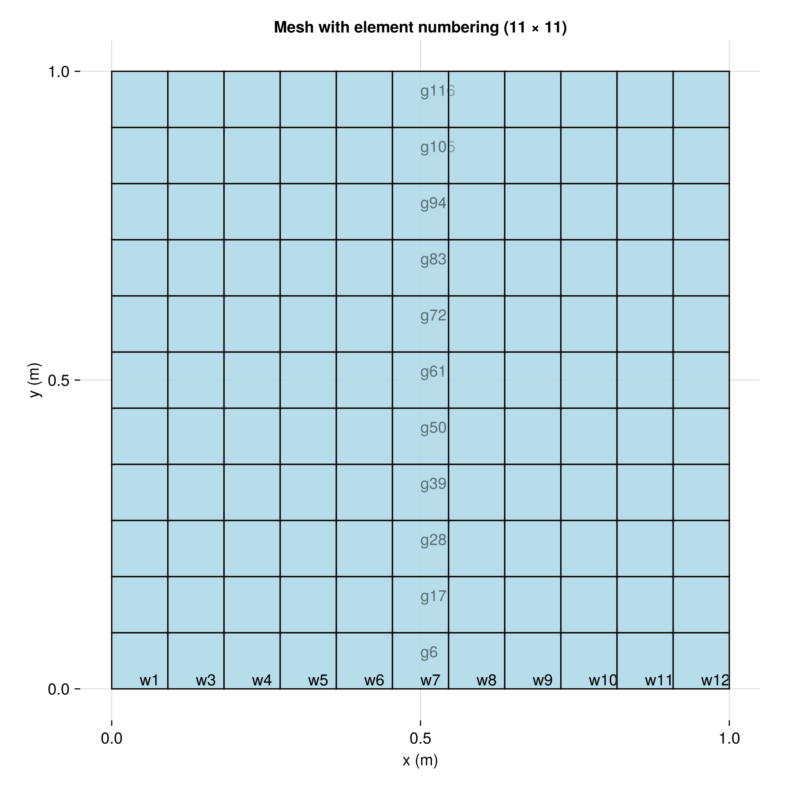
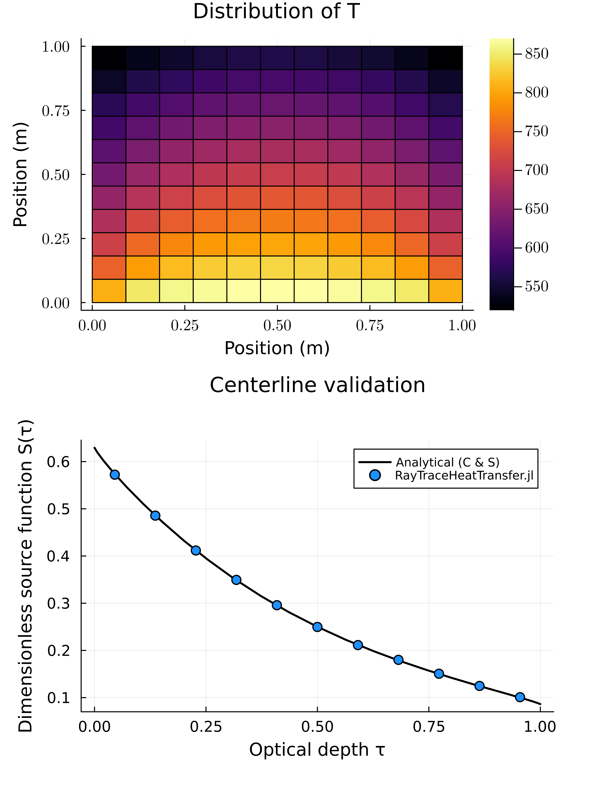
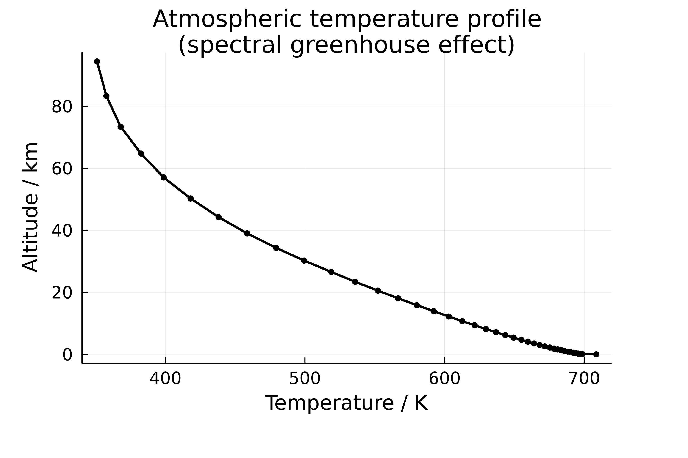
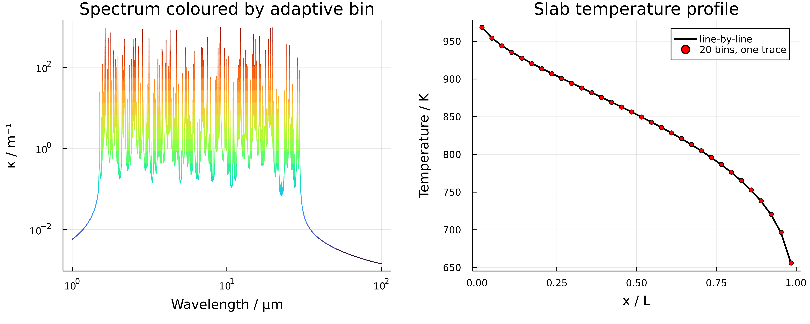
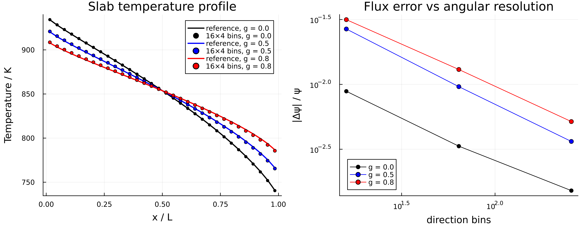
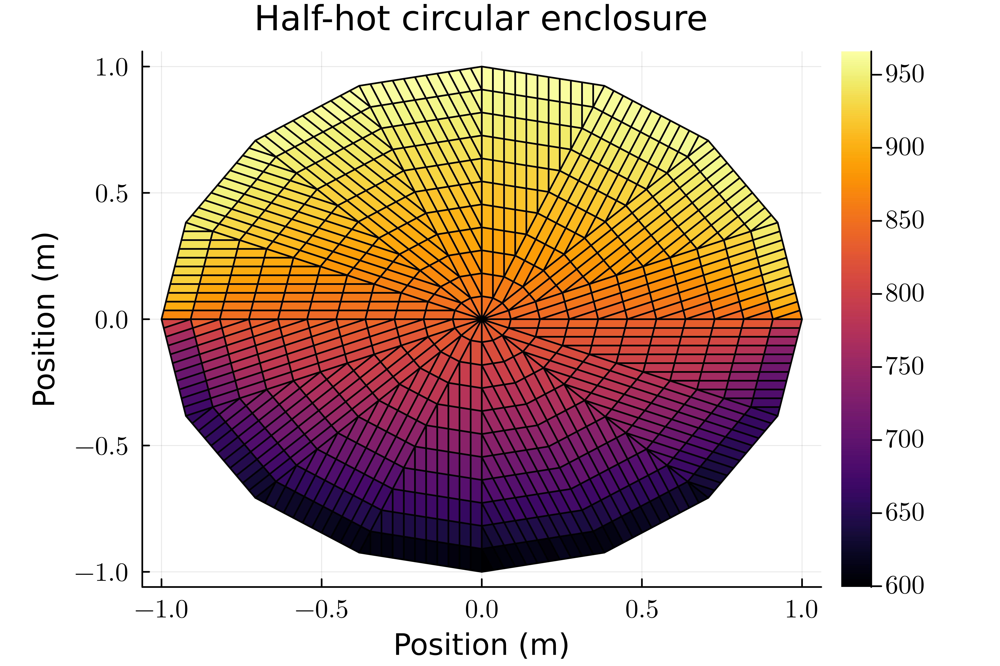
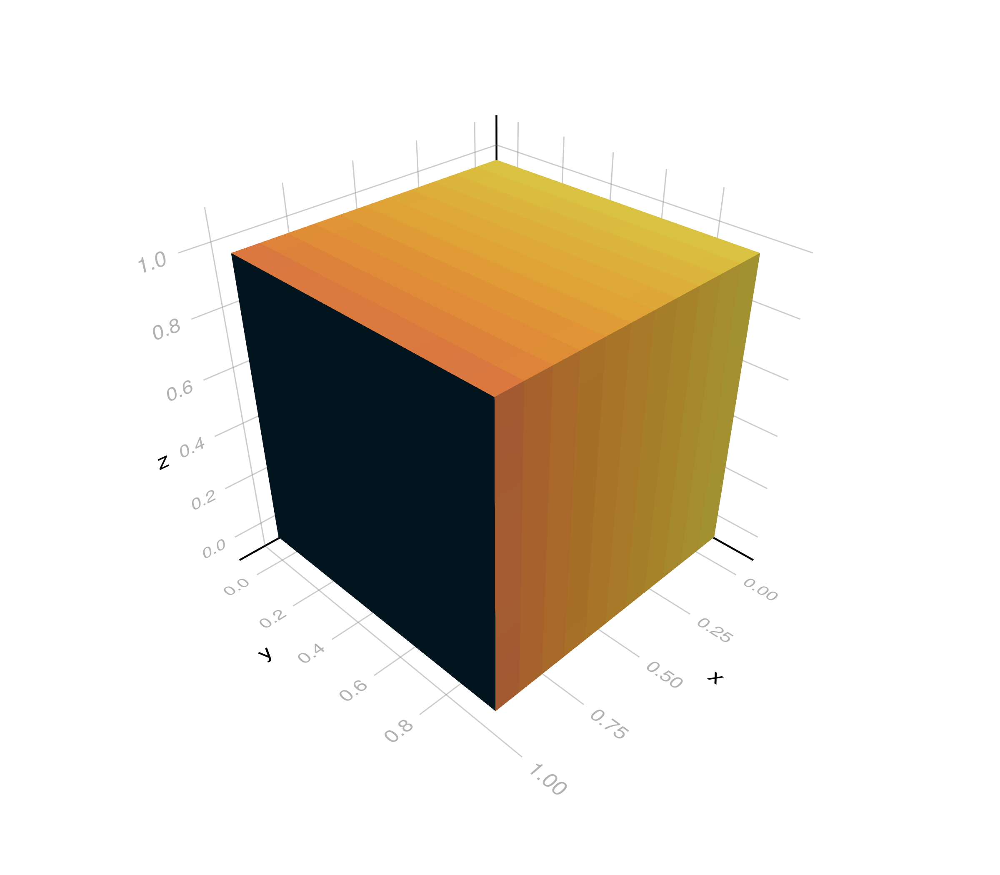
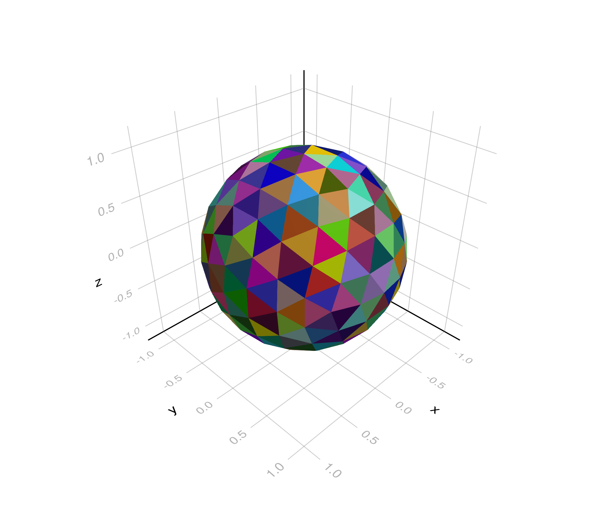
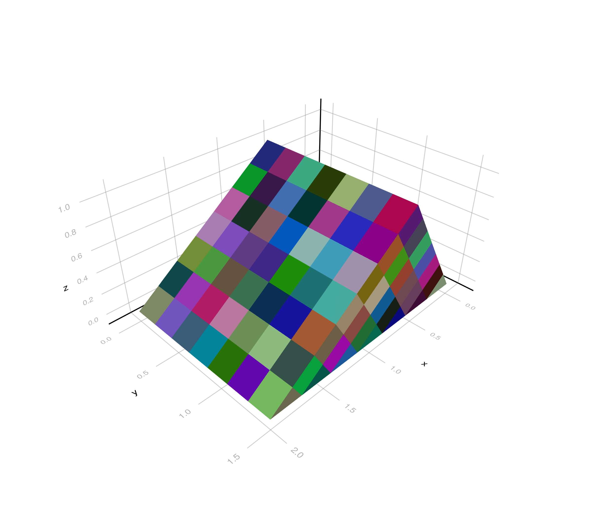
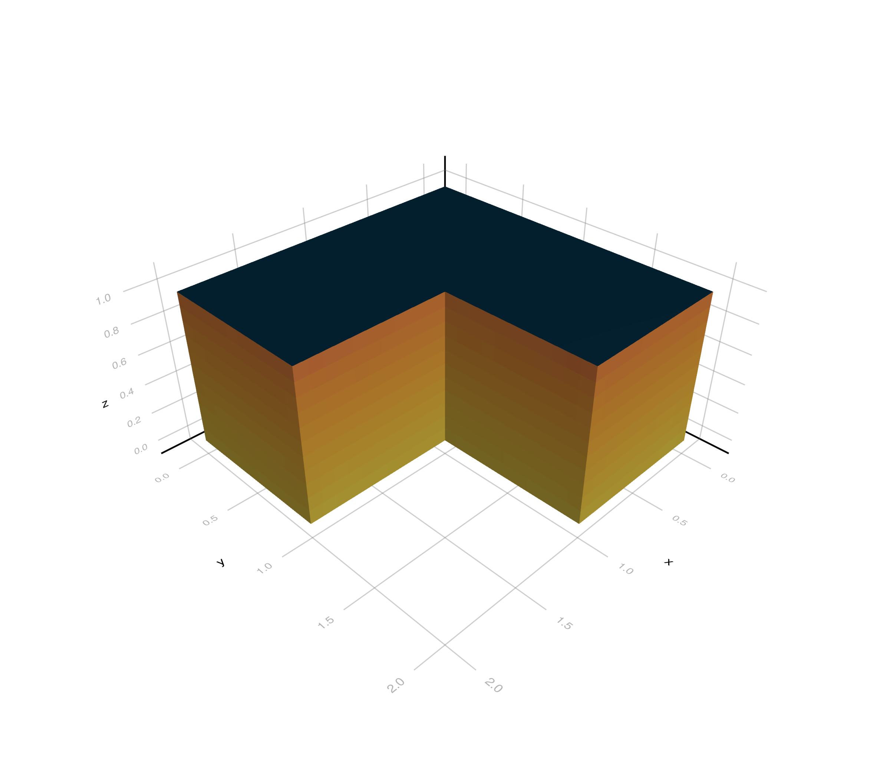

# RayTraceHeatTransfer.jl

A Julia package for radiative heat transfer using quasi-Monte Carlo ray tracing and the Graph Equilibrium Radiative Transfer (GERT, see [Bielefeld, 2026](https://arxiv.org/abs/2512.22157)) methods. Solves grey and spectral radiative equilibrium in 2D participating media and 3D surface enclosures, with unconditional energy conservation and exchange factor smoothing for machine precision reciprocity.

## Features

- **2D participating media** — absorbing, emitting, and scattering gases with enclosing surfaces
- **3D surface enclosures** — transparent media with semi-analytical view factors or ray tracing
- **Grey and spectral** — wavelength-independent or band-resolved radiation with automatic solver selection
- **Quasi-Monte Carlo sampling** — Sobol sequences by default, with results independent of the thread count and reproducible from a single seed
- **Adaptive spectral binning** — bins chosen automatically from κ(λ) samples to a user-set tolerance
- **Directional scattering and reflection** — Henyey–Greenstein or tabulated phase functions, specular or tabulated wall reflection, on angular bins with a user-set resolution (2D)
- **Unconditional energy conservation** — the GERT solve balances energy to machine precision for any number of rays, with or without smoothing
- **Exchange factor smoothing** — enforces reciprocity on the ray-traced factors to machine precision, which improves accuracy
- **Four-step workflow** — mesh → ray trace / view factors → smooth → solve
- **Plotting extensions** — GLMakie and Plots backends for mesh and field visualisation

## Installation

```julia
using Pkg
Pkg.add("RayTraceHeatTransfer")
```

For plotting, also install a Makie backend and/or Plots:

```julia
Pkg.add("GLMakie")   # for plotMesh (2D and 3D) and plotField (3D)
Pkg.add("Plots")     # for plotField (2D)
```

## Workflow

Every example below follows the same four steps:

1. **Mesh** — build the geometry and set boundary conditions.
2. **Exchange factors** — quasi-Monte Carlo ray tracing (2D participating media,
   3D surface enclosures) or analytical view factors (3D convex surface
   enclosures), producing exchange factor matrix `F_raw`.
3. **Smooth** — `smooth!(domain)` projects the exchange factor matrix `F_raw`
   onto the nearest matrix satisfying reciprocity and energy conservation,
   producing `F_smooth` and returning convergence diagnostics.
4. **Solve** — `solveEquilibrium!(domain, domain.F_smooth)` yields the
   steady state.

Step 3 is separate because it is a distinct computation with its own cost and
diagnostics, and because how much work it does varies enormously between
problems. `F_raw` arrives violating reciprocity: in 2D from sampling noise,
in 3D because the view factor formula is ill-conditioned for polygons that
share an edge and must be evaluated on a slightly perturbed geometry. On a
triangulated sphere, where every pair of adjacent faces has a nonzero view
factor, the raw reciprocity defect becomes significant; smoothing brings it to 10⁻¹⁵
(see Example 7). Both matrices remain available on the domain, so `F_raw` can
be inspected or exported, but `F_smooth` is what should be passed to the solver.

Smoothing is cheap relative to the tracing step, so `F_raw` can be traced once
and smoothed repeatedly with different settings. Spectral problems trace once
with `mesh(n; method = :pathlength)`, which builds `F_raw` for every bin from
the recorded paths; with `chunk_rays = n` the paths are kept and
`exchangeFactors!(mesh)` rebuilds `F_raw` for new coefficients or bins without
retracing (Example 3). With a `directional_model` set, the same trace also
resolves the exchange factors by ray direction (`G_raw`, `G_smooth`), and the
solver redistributes scattered and reflected power over the direction bins
according to each element's `phase` and `reflection` (Example 4). Every solve
stores its solution on the domain as `J`.

On a 2D domain the spectral model and the directional model are independent
settings and combine freely; `solveEquilibrium!` selects the solver from what is
set:

|                        | no `directional_model`          | `directional_model` set          |
|------------------------|---------------------------------|----------------------------------|
| grey                   | grey solver (Example 1)         | grey directional (Example 4)     |
| `spectral_model` set   | spectral solver (Examples 2, 3) | spectral directional             |

In the combined case the faces are built with their spectral bins as in
Example 3 and carry `phase` and `reflection` as in Example 4, optionally one
descriptor per spectral bin; one pathlength trace resolves the exchange factors
by bin and by direction, and the solution is `J[k][i, b]`. That solver is
currently limited in size (see the notes under Example 4).

## Sampling and reproducibility

The ray tracers draw emission positions and directions from Sobol sequences
(quasi-Monte Carlo) by default. Every emitter owns one sequence, digitally
shifted by a random mask derived from `seeds`, so the estimate is unbiased and
the stratification of the sequence is kept. At the same ray count the exchange
factors come out quieter than with pseudorandom sampling by 2–3× at 4096 rays
per emitter, and the gain grows with the ray count, reaching 10× at 65 536 rays
per emitter for the pathlength tracer: the same accuracy from up to a hundred
times fewer rays.

Two keywords control it, on the 2D domain functor and on
`RayTracingDomain3D_surfaces`:

- `sampler` — `:sobol`, the default wherever every ray consumes a fixed number
  of random numbers (`:exchange`, `:pathlength`, the 3D surface tracer), or
  `:random`, one pseudorandom stream per thread. The `:direct` tracer follows
  random walks and always samples pseudorandomly.
- `seeds` — with `:sobol`, a single integer selecting the realisation (default
  1); runs with different integers are statistically independent. With
  `:random`, one seed per thread, or a single integer selecting a block of
  per-thread seeds.

With the default sampler the result depends only on the geometry, the ray
count and `seeds`: not on the number of threads, and for `:pathlength` not on
`chunk_rays`. Rays per emitter that are powers of two make the best use of the
sequence; other counts work and lose roughly 10–20 % of the gain. Passing
`rngs`, or several seeds, together with the Sobol sampler is an error whose
message names the fix.

---

## Example 1 — 2D Grey Participating Medium

This example solves radiative equilibrium in a 1 × 1 m square enclosure filled with an absorbing gas (absorption coefficient: κ = 1 m⁻¹, no scattering: σₛ = 0 m⁻¹). The bottom wall is held at 1000 K and all other walls are at 0 K; all surfaces are black (ε = 1). The gas temperature field is found by solving the GERT system after computing exchange factors by ray tracing.

### Step 1: Define the geometry and mesh

```julia
using RayTraceHeatTransfer
using GeometryBasics, StaticArrays

function build_mesh(Ndim) # define a mesh builder function
    vertices = SVector(
        Point2(0.0, 0.0),
        Point2(1.0, 0.0),
        Point2(1.0, 1.0),
        Point2(0.0, 1.0)
    )
    solidWalls = SVector(true, true, true, true) # all walls impenetrable by radiation

    face = PolyVolume2D{Float64}(vertices, solidWalls, 1, 1.0, 0.0)  # κ=1, σₛ=0, for the gas volume

    face.T_in_w  = [1000.0, 0.0, 0.0, 0.0]   # bottom hot, rest cold
    face.epsilon = [1.0, 1.0, 1.0, 1.0]       # black walls
    face.T_in_g  = -1.0                         # unknown (solve for this)
    face.q_in_g  = 0.0                          # radiative equilibrium

    mesh = RayTracingDomain2D([face], [(Ndim, Ndim)]) # mesh the domain
    return mesh
end
Ndim = 11  # 11 × 11 elements
mesh1 = build_mesh(Ndim) # build the 11 × 11 mesh
```

### Understanding the mesh numbering

Each gas volume and solid wall surface in the mesh receives a global index that corresponds to a row/column in the exchange factor matrix. Use `plotMesh` with the `volumeNumbers` and `wallNumbers` keyword arguments to visualise specific indices:

```julia
using GLMakie

fig = Figure(size = (700, 700))
ax  = Axis(fig[1, 1], aspect = DataAspect(), xlabel = "x (m)", ylabel = "y (m)",
           title = "Mesh with element numbering (11 × 11)")

# Volumes are numbered row by row from the bottom, left to right within a row,
# so the volume in column c of row r has index c + (r − 1)·Ndim.
center_col = div(Ndim + 1, 2)                                          # the middle column (6 of 11)
centerline_vols = [center_col + (row - 1) * Ndim for row in 1:Ndim]    # that column's volume in every row

# Walls are numbered in the same cell order, and within a cell in the order bottom, right, top, left.
# The bottom-left corner cell owns two solid walls: its bottom edge is wall 1, its left edge wall 2.
# The remaining cells of the bottom row contribute their bottom edges as walls 3, 4, …, Ndim + 1.
bottom_wall_indices = [1; collect(3:Ndim+1)]                           # every element of the bottom (hot) wall

plotMesh(ax, mesh1)                                                     # the mesh itself
plotMesh(ax, mesh1; volumeNumbers = centerline_vols)                    # label the centreline volumes (g…)
plotMesh(ax, mesh1; wallNumbers = bottom_wall_indices)                  # label the bottom wall elements (w…)

fig
```



Volume elements are labelled **g*i*** and wall surfaces **w*i***. The indices shown here are the same indices used in the exchange factor matrix `mesh.F_smooth` and in the system matrices returned by the `buildSystemMatrices!` function (used internally). The system matrices row/column numberings always start with the surfaces, then volumes.

### Step 2: Ray trace (with optional ray recording)

```julia
record_ids = [10, 20, 30]  # optional ray recording for plotting (element numbers to record emission from)
rec = RayRecorder(record_ids)  # create the ray recorder (also works in parallel)
mesh1(10^7; method = :exchange, rec = rec)  # ray tracing with the Sobol sampler (optional ray recorder keyword)
origins, endpoints = collect_rays(rec)  # collect the results, can be used for plotting (one line per ray)
```

`:exchange` samples an absorption depth for every ray, and it is the tracer the
ray recorder belongs to. `:pathlength` records each ray's path through the
medium instead and deposits along it, which makes it several times more
accurate for participating media at the same ray count; it is the tracer used
in Examples 3 and 4.

### Step 3: Smooth

```julia
stats = smooth!(mesh1)  # enforce reciprocity and energy conservation on F_raw
```

`smooth!` produces `mesh1.F_smooth` and returns convergence diagnostics, one entry
per spectral bin, so a run can be checked without reading the log:

```julia
all(stats.converged)      # did the smoothing projection converge?
maximum(stats.delta_smooth)  # certified upper bound on the remaining reciprocity defect
```

The named tuple also carries iteration counts (`k_dykstra`, `k_ap`, `k_pcg_tot`,
`k_pcg_max`). See the `smooth!` docstring for the full description.

### Step 4: Solve

```julia
solveEquilibrium!(mesh1, mesh1.F_smooth)  # solve GERT system to obtain the steady state
```

### Step 5: Validate against Crosbie & Schrenker (1984)

The analytical solution for the dimensionless source function S(τ) = (T/T_hot)⁴ along the centerline of this problem is given by Crosbie & Schrenker (1984). Extracting the centerline temperatures from the solved mesh and comparing:

```julia
using Plots

# --- Left panel: solution temperature field via plotField ---
p1 = plotField(mesh1; field = :T, transparent_interfaces=true)
Plots.xlabel!(p1, "Position / m")
Plots.ylabel!(p1, "Position / m")
Plots.title!(p1, "Temperature distribution")

# Extract the centreline temperatures. The cells are stored row by row from the bottom (left to
# right within a row), so reshaping into an Ndim × Ndim matrix gives Tg_matrix[column, row].
all_temps  = [cell.T_g for cell in mesh1.fine_mesh[1]]     # T_g: gas temperature of every cell of the (single) coarse face
Tg_matrix  = reshape(all_temps, Ndim, Ndim)               # first index: column (x), second index: row (y)
centerline = Tg_matrix[div(Ndim + 1, 2), :]               # the middle column, from the hot wall upwards

# Dimensionless source function S = (T / T_hot)⁴ at the optical depth of every cell centre
S_computed  = (centerline ./ 1000.0) .^ 4                 # T_hot = 1000 K
tau_centers = range(1 / (2Ndim), 1 - 1 / (2Ndim), length = Ndim)   # τ = κ·y at the cell centres (κ = 1 m⁻¹, height 1 m)

# --- Crosbie & Schrenker (1984) analytical reference: optical depth from the hot wall, and S there ---
tau_ref = [0.0, 0.00611, 0.02037, 0.04251, 0.07216, 0.10884, 0.15194,
           0.20076, 0.25449, 0.31225, 0.37309, 0.43602, 0.50000, 0.56398,
           0.62691, 0.68775, 0.74551, 0.79924, 0.84806, 0.89116, 0.92784,
           0.95749, 0.97963, 0.99390, 1.00000]

S_ref  = [0.6293, 0.6198, 0.6017, 0.5767, 0.5460, 0.5108, 0.4724,
          0.4323, 0.3919, 0.3525, 0.3153, 0.2810, 0.2500, 0.2224,
          0.1981, 0.1768, 0.1584, 0.1424, 0.1287, 0.1171, 0.1073,
          0.0992, 0.0930, 0.0885, 0.0863]

# --- Bottom panel: centerline validation ---
p2 = Plots.plot(tau_ref, S_ref,
    linewidth = 2, color = :black, label = "Reference (C & S, 1984)",
    xlabel = "Optical depth τ",
    ylabel = "Dimensionless source function S(τ)",
    title = "Centreline validation",
    legend = :topright,
    dpi = 1000,
    guidefontsize = 12,
    tickfontsize = 10)

Plots.scatter!(p2, tau_centers, S_computed,
    color = :dodgerblue, markersize = 5, label = "RayTraceHeatTransfer.jl")
Plots.plot!(p2, top_margin=8Plots.mm, bottom_margin=8Plots.mm)

# --- Combined figure ---
Plots.plot!(p1, guidefontsize=12, tickfontsize=10, 
            left_margin=5Plots.mm, right_margin=10Plots.mm)
p = Plots.plot(p1, p2, layout = (2,1), size = (600, 800), dpi=1000)
display(p)
```



The top panel shows the 2D temperature field; the bottom panel compares the computed centerline source function (blue dots) with the analytical reference (black line).

To put a number on the agreement, the reference has to be evaluated where the solution lives. It is tabulated at 25 unevenly spaced optical depths, while the solution is known at the 11 cell centres. [ConvolutionInterpolations.jl](https://github.com/NikoBiele/ConvolutionInterpolations.jl) interpolates the table to the cell centres with a high-order kernel (`:b13` accepts nonuniform grids), after which the two can be compared point by point:

```julia
using ConvolutionInterpolations                                             # ] add ConvolutionInterpolations

S_ref_itp   = convolution_interpolation((tau_ref,), S_ref; kernel = :b13)   # the reference as a function of optical depth
S_ref_cells = [S_ref_itp(tau) for tau in tau_centers]                       # the reference at the 11 cell centres

deviation = S_computed .- S_ref_cells                                       # solution minus reference, cell by cell
rms_dev   = sqrt(sum(abs2, deviation) / Ndim)                               # root-mean-square deviation along the centreline
max_dev   = maximum(abs.(deviation))                                        # largest deviation along the centreline

println("Deviation from Crosbie & Schrenker: rms = ", round(rms_dev; sigdigits = 2),
        ", max = ", round(max_dev; sigdigits = 2))                          # both in units of S, which runs from 0.09 to 0.63
```

For 10⁷ rays on the 11 × 11 mesh this prints an rms deviation of 2.4 × 10⁻⁴ and a maximum of 4.5 × 10⁻⁴, on a source function that runs from 0.09 to 0.63. The reference is tabulated to four decimals, so deviations below about 10⁻⁴ cannot be resolved by this comparison.

### Step 6: Energy conservation, and why it is not the same as accuracy

After the solve, displaying the domain prints a summary whose last line is the relative energy conservation error: everything that leaves the elements, minus everything that is absorbed or reflected somewhere, relative to the total.

```
RayTracingDomain2D
  geometry   1 coarse face → 121 volumes, 44 surfaces
  boundary   44 prescribed T, 121 prescribed source
  spectral   grey
  exchange   F_raw     165×165 sparse
             F_smooth  165×165 dense
  energy     6.34e-17 (relative conservation error)
```

The value is also available as `mesh.energy_error`. It sits at machine precision, and it does so for any number of rays: the rows of the exchange factor matrix sum to one, so the power that leaves the elements and the power that arrives at them are equal by construction, however well or badly the factors were sampled. Repeating the example with a thousand times fewer rays shows it, and shows at the same time that conservation says nothing about accuracy:

```julia
# rms deviation of the centreline source function from the interpolated reference (as in Step 5)
function centreline_rms(m)
    all_temps  = [cell.T_g for cell in m.fine_mesh[1]]                  # gas temperature of every cell
    centerline = reshape(all_temps, Ndim, Ndim)[div(Ndim + 1, 2), :]    # the middle column, from the hot wall upwards
    S          = (centerline ./ 1000.0) .^ 4                            # dimensionless source function
    tau        = range(1 / (2Ndim), 1 - 1 / (2Ndim), length = Ndim)     # optical depth of the cell centres
    return sqrt(sum(abs2, S .- [S_ref_itp(t) for t in tau]) / Ndim)     # rms deviation from the reference
end

few = build_mesh(Ndim)                                   # the same domain again
few(10^4; method = :exchange)                            # 10⁴ rays instead of 10⁷: about 60 per element
smooth!(few)                                             # reciprocity on the noisy factors
solveEquilibrium!(few, few.F_smooth)                     # solve with the smoothed factors
few.energy_error, centreline_rms(few)                    # conservation error and accuracy

solveEquilibrium!(few, few.F_raw)                        # solve again, now with the raw factors
few.energy_error, centreline_rms(few)                    # conservation error and accuracy
```

| rays | factors | energy conservation error | rms deviation from reference |
|---|---|---|---|
| 10⁷ | smoothed | 6.3 × 10⁻¹⁷ | 2.4 × 10⁻⁴ |
| 10⁴ | smoothed | 7.9 × 10⁻¹⁷ | 3.1 × 10⁻² |
| 10⁴ | raw | 7.5 × 10⁻¹⁶ | 8.1 × 10⁻² |

Energy conservation is guaranteed by the formulation, so every GERT solution has it, the noisy ones included. How accurate a solution is, is a separate question: that depends on the number of rays, and it benefits from smoothing, which enforces reciprocity and here reduces the deviation by a factor of 2.6. A solution that conserves energy is therefore not automatically an accurate one, but an accurate GERT solution never has to be paid for with an energy imbalance.

### References

> Crosbie, A. L. & Schrenker, R. G. (1984). "Radiative transfer in a two-dimensional rectangular medium exposed to diffuse radiation." *Journal of Quantitative Spectroscopy and Radiative Transfer*, 31(4), 339–372.

> Bielefeld, N. M. (2026). "A Radiation Exchange Factor Formulation with Proven Non-Negativity and Unconditional Energy Conservation" *arXiv preprint*, [arXiv:2512.22157](https://arxiv.org/abs/2512.22157).

---

## Example 2 — Spectral Greenhouse Atmosphere

This example models a simplified planetary atmosphere to demonstrate the spectral solver. The atmosphere is transparent in the visible and opaque in the infrared, producing a greenhouse effect: solar radiation penetrates to the surface, while thermal emission from the warm surface is trapped by the absorbing gas. The equilibrium surface temperature, which is not prescribed, emerges far above the value for a transparent atmosphere.

The geometry is a vertical stack of 20 sub-enclosures representing atmospheric layers, each with spectrally distinct absorption. A thin volume at the top emits at solar temperature, acting as the radiation source. The domain is wide relative to its height, approximating a 1D atmosphere.

### Step 1: Define the atmosphere

```julia
using RayTraceHeatTransfer
using GeometryBasics, StaticArrays

atm_height   = 100_000.0     # atmosphere height (m)
L            = atm_height    # normalization length
N_layers     = 20            # atmospheric layers
width        = 100.0         # normalized width (wide domain ≈ 1D)
scale_height = 15_900.0      # density scale height (m)
T_sun        = 5800.0        # solar temperature (K)
q_solar      = 2 * 2600.0    # isotropic solar flux (both up and down) (W/m²)
κ_vis        = 0.01          # visible absorption coefficient
κ_ir         = 100.0         # infrared absorption coefficient
λ_min        = 1e-9          # minimum wavelength (m)
λ_max        = 1.0           # maximum wavelength (m)
stretch      = 5.0           # spatial layer clustering near surface
```

The spectral range spans from 1 nm to 1 m; wide enough to capture the full Planck distribution at all temperatures in the problem. An insufficient spectral range forces energy into edge bins and degrades the solution.

### Step 2: Build the spectral bins and layer geometry

`adaptiveSpectralBins` groups wavelengths sharing a κ-level into bins and refines until
a Planck-weighted transmission-error bound meets tol; the bin count follows the κ range and tolerance,
not the spectrum's complexity. Layers that differ by a scale factor share the bins via scale_range.

```julia
# Log-spaced spatial layers: thin near the surface where temperature
# gradients are steepest, thick higher up where the atmosphere thins
layer_param      = range(0.0, 1.0, length = N_layers + 1)
layer_edges_norm = [(exp(stretch * t) - 1) / (exp(stretch) - 1) for t in layer_param]

# Solar volume: a thin layer at the top whose emission matches the desired
# irradiance. This avoids modifying the solver for spectral boundary fluxes.
sun_layer_height = 1000.0     # 1 km thick
κ_sun = q_solar * L / (4 * 5.670374419e-8 * T_sun^4 * sun_layer_height) # tuned absorption coefficient (emission)

normalized_scale_height = scale_height / L

# Reference spectrum (ρ = 1) on a fine wavelength grid
λ = 10 .^ range(log10(λ_min), log10(λ_max), length = 20_001)
κ_samples = [κ_vis + (κ_ir - κ_vis) / (1 + (4e-6 / x)^6) for x in λ]

ρ_top = exp(-1.0 / normalized_scale_height) # density at top
model = adaptiveSpectralBins(λ, κ_samples;
    tol         = 1e-3, # or 1e-4 for higher accuracy
    L_range     = (layer_edges_norm[2], 1.0),  # thinnest layer .. atmosphere height
    T_range     = (150.0, T_sun),
    scale_range = (ρ_top, 1.0))
n_bins = length(model.κ_ref) # 15 bins
```

### Step 3: Assemble the atmospheric layers

Each layer has a spectrally distinct absorption coefficient: a sigmoid transition around λ = 4 μm separates the transparent visible window (κ ≈ 0.01) from the opaque infrared (κ ≈ 100), scaled by the local atmospheric density. This spectral asymmetry is the mechanism behind the greenhouse effect.

```julia
faces     = PolyVolume2D{Float64}[]
divisions = Tuple{Int,Int}[]

for j in 1:N_layers
    y_bot = layer_edges_norm[j]
    y_top = layer_edges_norm[j + 1]
    y_mid = (y_bot + y_top) / 2

    verts = SVector(
        Point2(0.0, y_bot), Point2(width, y_bot),
        Point2(width, y_top), Point2(0.0, y_top)
    )
    solidwalls = SVector((j == 1), true, false, true) # transparent horizontal walls

    # Exponential density decay
    ρ = exp(-y_mid / normalized_scale_height)

    # Spectral absorption: sigmoid from visible-transparent to IR-opaque
    layer_κ = ρ .* model.κ_ref

    face = PolyVolume2D{Float64}(verts, solidwalls, n_bins, 1.0, 0.0)
    face.kappa_g   = layer_κ # local spectral absorption coefficients
    face.sigma_s_g = fill(0.0, n_bins) # local spectral scattering coefficients
    face.epsilon   = [fill(1.0, n_bins) for _ in 1:4]
    face.T_in_g    = -1.0       # solve for gas temperature
    face.q_in_g    = 0.0        # radiative equilibrium

    if j == 1
        face.T_in_w = [-1.0, 0.0, 0.0, 0.0]  # free surface, cold sides
    else
        face.T_in_w = [0.0, 0.0, 0.0, 0.0]   # cold boundaries
    end
    face.q_in_w = [0.0, 0.0, 0.0, 0.0] # source flux

    push!(faces, face)
    push!(divisions, (1, 2)) # each layer must be divided for the ray tracer to work
end
```

In general, to solve for temperature, set `T=-1`. Then the solver uses the prescribed flux to solve for `T`. Any non-negative prescribed `T` will remain fixed, then the solved determines the source flux `q`. At least one `T` in the domain must be fixed.

### Step 4: Add the solar source and build the mesh

```julia
sun_h_norm = sun_layer_height / L
verts_sun  = SVector(
    Point2(0.0, 1.0), Point2(width, 1.0),
    Point2(width, 1.0 + sun_h_norm), Point2(0.0, 1.0 + sun_h_norm)
)

face_sun = PolyVolume2D{Float64}(
    verts_sun, SVector(false, true, true, true), n_bins, κ_sun, 0.0);
face_sun.kappa_g   = fill(κ_sun, n_bins) # spectrally uniform absorption coefficient
face_sun.sigma_s_g = fill(0.0, n_bins) # local spectral scattering coefficients
face_sun.epsilon   = [fill(1.0, n_bins) for _ in 1:4] # black space (fully absorbing)
face_sun.T_in_g    = T_sun # prescribed solar temperature
face_sun.q_in_g    = 0.0 # uses temperature
face_sun.T_in_w    = [0.0, 0.0, 0.0, 0.0] # cold space behind the sun (fully absorbing)
face_sun.q_in_w    = [0.0, 0.0, 0.0, 0.0] # uses temperature

push!(faces, face_sun)
push!(divisions, (1, 2)) # each layer must be divided for the ray tracer to work

mesh = RayTracingDomain2D(faces, divisions) # mesh the domain
mesh.spectral_model = model # spectral model
```
Hand-chosen bands remain available as `PlanckBands(λ_edges)`.

### Step 5: Ray trace, smooth and solve

```julia
mesh(2*10^6; method = :exchange)
# smooth the ray tracing result to enforce energy conservation and reciprocity
# opt-in to pure Dykstra smoothing
smooth!(mesh, k_dykstra=1000)
solveEquilibrium!(mesh, mesh.F_smooth;
    max_iters = 10_000, convergence_tol = 1e-14)
```

Ray tracing is performed independently for each spectral bin, computing separate exchange factor matrices that represent the wavelength-dependent extinction. The spectral equilibrium solver then iterates to find the temperature distribution that simultaneously satisfies energy conservation across all bins.

### Step 6: Extract and plot the temperature profile

```julia
using Plots

gas_temps = Float64[]                                   # temperatures from the ground upwards [K]
altitudes = Float64[]                                   # matching altitudes [m]

# The ground is the bottom wall (wall 1) of the lowest cell of the lowest layer.
# Indexing: fine_mesh[layer][cell]; T_w[wall] is that wall's temperature from the solver.
push!(gas_temps, mesh.fine_mesh[1][1].T_w[1])
push!(altitudes, 0.0)

# Every layer was meshed into 2 cells stacked vertically (divisions (1, 2)): visit them from the bottom up.
for j in 1:N_layers                                     # atmospheric layers only; the solar layer on top is skipped
    for k in 1:2                                        # lower cell, then upper cell
        cell = mesh.fine_mesh[j][k]
        push!(gas_temps, cell.T_g)                      # T_g: gas temperature from the solver
        push!(altitudes, cell.midPoint[2] * L)          # cell-centre height: normalised y times the atmosphere height L
    end
end

p = Plots.plot(gas_temps, altitudes ./ 1000,
    linewidth = 2, color = :black, marker = :circle, markersize = 3,
    ylabel = "Altitude / km", xlabel = "Temperature / K",
    title = "Atmospheric temperature profile\n(spectral greenhouse effect)",
    legend = false, dpi = 500,
    guidefontsize = 12, tickfontsize = 10,
    left_margin = 5Plots.mm, bottom_margin = 10Plots.mm,
    right_margin = 15Plots.mm)

display(p)
```



The surface temperature emerges well above the bare blackbody equilibrium; a direct consequence of the spectral asymmetry between incoming (visible) and outgoing (infrared) radiation. Temperature decreases monotonically with altitude as the atmosphere thins and becomes transparent.

> **Note:** This is a simplified radiative equilibrium model without convection, latent heat, or detailed molecular absorption bands. Nevertheless, it captures the essential greenhouse mechanism from first principles: the spectral solver enforces energy conservation across the full spectrum to machine precision, and the temperature profile emerges purely from the exchange of radiation between layers.

The spectral solver is an unpublished extension of the grey GERT method described in [Bielefeld (2026)](https://arxiv.org/abs/2512.22157). It solves the coupled spectral equilibrium by iterating over Planck-weighted band contributions while preserving the exchange factor framework and its energy conservation guarantees.

---

## Example 3 — Line Spectrum vs Line-by-Line Reference

A slab of gas between two black plates at 1000 K and 500 K, with a synthetic
line spectrum: 400 Lorentzian lines on a weak continuum, absorption
coefficients spanning five decades, from optically thin to thick across the
1 m slab. Fixed wavelength bands cannot resolve such a spectrum — a band
straddling a line averages opaque and transparent wavelengths into a meaningless
mean. Adaptive binning groups wavelengths by κ instead, so line cores, wings and
continuum land in bins of their own regardless of where they sit in the
spectrum, and one pathlength trace serves every bin.

The result is checked against an independent line-by-line solution of the
same slab: exact exponential-integral quadrature at every wavelength, radiative
equilibrium by Newton on the cell temperatures, itself verified against
Heaslet & Warming (1965) in the grey limit. The reference lives in
`examples/lbl_slab_reference.jl` and is exercised by the test suite.

The formulation follows [Modest & Mazumder (2022)](https://doi.org/10.1016/C2018-0-03206-5),
*Radiative Heat Transfer*, 4th ed., Ch. 13, with the grey benchmark values of
[Heaslet & Warming (1965)](https://doi.org/10.1016/0017-9310(65)90083-9), Table 13.1 therein.

### Step 1: Spectrum and reference solution

```julia
using RayTraceHeatTransfer
using GeometryBasics, StaticArrays, Random
include(joinpath(pkgdir(RayTraceHeatTransfer), "examples", "lbl_slab_reference.jl"))

T1, T2 = 1000.0, 500.0                        # hot and cold plate temperatures [K]
NX = 32                                       # number of cells across the slab

# wavelength grid: 200 001 points, logarithmically spaced from 10 nm to 1 cm
λ = 10 .^ range(log10(1e-8), log10(1e-2), length = 200_001)

# 400 synthetic absorption lines with random centre, width and strength (fixed seed: reproducible)
lines = let rng = MersenneTwister(1)
    centres = 10 .^ (log10(1.5e-6) .+ (log10(30e-6) - log10(1.5e-6)) .* rand(rng, 400))   # 1.5–30 μm, uniform in log λ
    peaks   = 10 .^ (log10(0.1) .+ 5.0 .* rand(rng, 400))                                  # peak strengths over five decades
    widths  = 1e-4 .+ 2e-4 .* rand(rng, 400)                                               # half-widths, in decades of λ
    collect(zip(centres, widths, peaks))                                                   # one (centre, half-width, peak) per line
end

# Absorption coefficient [1/m] at wavelength x: a weak continuum plus the sum of all lines.
# Each line is a Lorentzian in log₁₀ λ: peak / (1 + (distance from the centre / half-width)²).
function absorption(x)
    line_sum = 0.0
    for (centre, half_width, peak) in lines
        distance = log10(x / centre)                       # distance from the line centre, in decades of λ
        line_sum += peak / (1 + (distance / half_width)^2)
    end
    return 0.1 * (1e-3 + line_sum)                         # continuum 1e-3, overall scale 0.1
end
κ = [absorption(x) for x in λ]

T_lbl, q_lbl, _ = lbl_slab_equilibrium(λ, κ, 1.0, T1, T2; Nx = NX)   # line-by-line reference, slab thickness 1 m
ψ_lbl = q_lbl / (LBL_σ * (T1^4 - T2^4))       # net flux, normalised by the black-plate exchange
```

### Step 2: Adaptive bins

```julia
model = adaptiveSpectralBins(λ, κ; tol = 1e-2, L_range = (1 / NX, 3.0), T_range = (T2, T1))
K = length(model.κ_ref)                       # 20 bins from 1881 wavelength pieces
```

`tol` bounds the Planck-weighted transmission error of every bin over path
lengths from one cell to a few slab thicknesses; the bin count is an output.

### Step 3: Slab as a wide cavity

The 2D solver has no plane-parallel mode, so the slab is a cavity 100_000× wider
than tall with cold, nearly non-reflecting sides; the centre column is the
1D solution.

```julia
W, NX_H = 100_000.0, 5                        # cavity width [m] and number of columns of cells
verts = SVector(Point2(0.0, 0.0), Point2(W, 0.0), Point2(W, 1.0), Point2(0.0, 1.0))   # corners, counter-clockwise
face  = PolyVolume2D{Float64}(verts, SVector(true, true, true, true), K, 1.0, 0.0)    # four solid walls, K spectral bins
face.kappa_g   = copy(model.κ_ref)            # absorption coefficient of every bin [1/m]
face.sigma_s_g = zeros(K)                     # no scattering
face.epsilon   = [fill(1.0, K), fill(1.0, K), fill(1.0, K), fill(1.0, K)]   # black in every bin; wall order: bottom, right, top, left
face.T_in_w    = [T1, 0.0, T2, 0.0]           # wall temperatures [K]: bottom T1, top T2, sides at 0 K
face.q_in_w    = zeros(4)                     # wall sources, not used when the temperature is prescribed
face.T_in_g    = -1.0                         # negative: the gas temperature is unknown ...
face.q_in_g    = 0.0                          # ... and its net source is zero, i.e. radiative equilibrium

mesh = RayTracingDomain2D([face], [(NX_H, NX)])   # 5 columns × 32 rows of cells
mesh.spectral_model = model
```

### Step 4: Trace once, smooth, solve

```julia
mesh(10^7; method = :pathlength, chunk_rays=10^7) # one chunk: paths kept, re-binnable via `exchangeFactors!(mesh)`
smooth!(mesh; k_dykstra=200, k_ap=10^4) # smoothing: 200 dykstra rounds, ≤ 10⁴ alternating-projections
solveEquilibrium!(mesh, mesh.F_smooth; max_iters = 20_000, convergence_tol = 1e-12)

# The side walls disturb the columns next to them; the centre column of the wide
# cavity is the 1D slab solution.
i_centre = (NX_H + 1) ÷ 2                                   # index of the centre column (3 of 5)
x_centre = (i_centre - 0.5) * W / NX_H                      # x-coordinate of its cell centres
centre_cells = [cell for cell in mesh.fine_mesh[1]          # all cells of the first (and only) coarse face ...
                if abs(cell.midPoint[1] - x_centre) < 1e-9 * W]   # ... whose centre lies in that column
sort!(centre_cells, by = cell -> cell.midPoint[2])          # order them from the hot plate (y = 0) upwards

T_pkg = [cell.T_g for cell in centre_cells]                 # T_g: gas temperature written by the solver

bottom = centre_cells[1]                                    # the cell touching the hot plate
# wall 1 of a cell is its bottom edge; q_w is that wall's net radiative power [W], area its length [m]
ψ_pkg = (bottom.q_w[1] / bottom.area[1]) / (LBL_σ * (T1^4 - T2^4))   # net flux, normalised
```

### Step 5: Compare

```julia
using Plots

# The model cuts the wavelength axis into pieces at `model.edges`; piece p belongs to bin `model.piece_bin[p]`.
# For every wavelength sample: find the piece it falls in, then look up that piece's bin.
n_spectral = length(model.piece_bin)
piece = clamp.(searchsortedlast.(Ref(model.edges), λ), 1, n_spectral)  # index of the last edge ≤ λ, kept within 1:n_spectral
bin   = model.piece_bin[piece]                                         # bin index of every wavelength sample
sel   = 1e-6 .<= λ .<= 1e-4                                            # plot 1–100 μm only, where the lines are

p1 = Plots.plot(λ[sel] .* 1e6, κ[sel]; line_z = bin[sel], color = :turbo, linewidth = 1,
    xscale = :log10, yscale = :log10, xlabel = "Wavelength / μm", ylabel = "κ / m⁻¹",
    colorbar_title = "bin", legend = false, title = "Spectrum coloured by adaptive bin")

x_c = ((1:NX) .- 0.5) ./ NX
p2 = Plots.plot(x_c, T_lbl; linewidth = 2, color = :black, label = "line-by-line",
    xlabel = "x / L", ylabel = "Temperature / K", title = "Slab temperature profile")
Plots.scatter!(p2, x_c, T_pkg; color = :red, markersize = 3, label = "20 bins, one trace")

p = Plots.plot(p1, p2; layout = (1, 2), size = (1000, 400), dpi = 500,
    left_margin = 5Plots.mm, bottom_margin = 8Plots.mm)
display(p)
```



Tightening the tolerance, against the line-by-line reference (ψ_LBL = 0.49718):

| tol  | bins | pieces | bound   | max ΔT, 10⁷ rays | max ΔT, 10⁸ rays | ψ − ψ_LBL, 10⁸ rays |
|------|-----:|-------:|--------:|-----------------:|-----------------:|--------------------:|
| 1e-2 |   20 |   1881 | 3.7e-3  |           0.40 K |           0.42 K |             +1.7e-4 |
| 1e-3 |   31 |   3449 | 9.3e-4  |           0.47 K |           0.16 K |             −7.2e-6 |
| 1e-4 |  128 |  17165 | 9.9e-5  |           0.48 K |           0.11 K |             +3.5e-5 |

Two limits are visible. At 10⁷ rays every row sits on the sampling floor of
about 0.45 K, so a tighter tolerance buys nothing; at 10⁸ rays that floor drops
to about 0.14 K, the 20-bin row is left at the 0.4 K its tolerance allows, and
31 bins already reach the floor. Tighten `tol` until the error stops improving,
then add rays.

All rows of a column come from the same recorded paths. The number of bins is
fixed when the faces are built, so each tolerance gets a new mesh, which takes
over the paths instead of tracing again:

```julia
model2 = adaptiveSpectralBins(λ, κ; tol = 1e-3, L_range = (1 / NX, 3.0), T_range = (T2, T1))
K2 = length(model2.κ_ref)                       # 31 bins

# the number of spectral bins is fixed when a face is built, so the tighter model needs a new face ...
face2 = PolyVolume2D{Float64}(verts, SVector(true, true, true, true), K2, 1.0, 0.0)
face2.kappa_g   = copy(model2.κ_ref)            # one absorption coefficient per bin
face2.sigma_s_g = zeros(K2)                     # no scattering
face2.epsilon   = [fill(1.0, K2), fill(1.0, K2), fill(1.0, K2), fill(1.0, K2)]
face2.T_in_w    = [T1, 0.0, T2, 0.0]            # same boundary conditions as before
face2.q_in_w    = zeros(4)
face2.T_in_g    = -1.0
face2.q_in_g    = 0.0

# ... and a new mesh with the same subdivision, hence the same element numbering
mesh2 = RayTracingDomain2D([face2], [(NX_H, NX)])
mesh2.spectral_model = model2
mesh2.path_store = mesh.path_store              # take over the recorded paths: they are geometry only
exchangeFactors!(mesh2)                         # F_raw for the 31 bins, without tracing again
```

Re-binning geometric rays takes much less time than repeating the trace itself.

---

## Example 4 — Anisotropic Scattering vs a Discrete-Ordinates Reference

A grey slab between two black plates at 1000 K and 500 K, optical thickness 1,
scattering albedo 0.8, with Henyey–Greenstein scattering. Forward scattering
carries radiation through the slab instead of returning it: at g = 0.8 the net
flux is 37 % higher than for isotropic scattering and the gas next to the hot
plate is 26 K colder. The default solvers cannot see this — they redistribute
scattered power isotropically. With a `directional_model` the exchange factors
are resolved by ray direction from the same pathlength trace, and each element
redistributes what it scatters or reflects over the direction bins according to
its `phase` and `reflection`.

The result is checked against an independent deterministic solution of the same
slab: 1D discrete ordinates on double-Gauss quadrature, the azimuthally averaged
Henyey–Greenstein kernel from its Legendre series, a cell-constant source with
exact attenuation along every ordinate, and radiative equilibrium solved as one
linear system. It reproduces Heaslet & Warming (1965) at g = 0 and the grey
line-by-line reference of Example 3. The reference lives in
`examples/anisotropic_slab_reference.jl` and is exercised by the test suite.

The phase function is that of [Henyey & Greenstein (1941)](https://doi.org/10.1086/144246);
the grey benchmark values are those of
[Heaslet & Warming (1965)](https://doi.org/10.1016/0017-9310(65)90083-9).

### Step 1: Reference solutions

```julia
using RayTraceHeatTransfer
using GeometryBasics, StaticArrays
include(joinpath(pkgdir(RayTraceHeatTransfer), "examples", "anisotropic_slab_reference.jl"))

T1, T2 = 1000.0, 500.0                        # hot and cold plate temperatures [K]
κ, σ_s = 0.2, 0.8                             # absorption and scattering coefficients [1/m]: extinction 1, albedo 0.8
NX = 32                                       # number of cells across the slab
gs = (0.0, 0.5, 0.8)                          # asymmetry factors: isotropic, moderate, strongly forward

ψ(q) = q / (ASLAB_σ * (T1^4 - T2^4))          # net flux normalised by the black-plate exchange σ(T1⁴ − T2⁴)

T_ref = Dict{Float64,Vector{Float64}}()       # reference temperature profile for every g
ψ_ref = Dict{Float64,Float64}()               # reference normalised flux for every g
for g in gs
    T, q = anisotropic_slab_equilibrium(κ, σ_s, g, 1.0, T1, T2; Nx = NX)   # slab of thickness 1 m
    T_ref[g] = T
    ψ_ref[g] = ψ(q)
end
```

### Step 2: Slab as a narrow cavity with mirror sides

Specular adiabatic side walls make a cavity of any width equivalent to the
infinite slab by symmetry, so a narrow one suffices. Their emissivity cannot be
zero for a radiative-equilibrium surface; 0.01 leaves 1 % of their interaction
diffuse. Descriptors are inherited by the fine mesh, so they are set on the face
before meshing, like `epsilon` and `kappa_g`.

```julia
W, NX_H = 2.0, 4
verts = SVector(Point2(0.0, 0.0), Point2(W, 0.0), Point2(W, 1.0), Point2(0.0, 1.0))
face  = PolyVolume2D{Float64}(verts, SVector(true, true, true, true), 1, κ, σ_s)
face.epsilon    = [1.0, 0.01, 1.0, 0.01]
face.T_in_w     = [T1, -1.0, T2, -1.0]        # bottom T1, top T2, sides adiabatic
face.q_in_w     = zeros(4)
face.T_in_g     = -1.0
face.q_in_g     = 0.0
face.phase      = HenyeyGreenstein(0.8)
face.reflection = [DiffuseReflection(), SpecularReflection(1.0), DiffuseReflection(), SpecularReflection(1.0)]

mesh = RayTracingDomain2D([face], [(NX_H, NX)])
mesh.directional_model = AngularBins(16, 4)   # 16 azimuthal × 4 out-of-plane direction bins
```

### Step 3: Trace once, smooth, solve

The angular exchange factors and their smoothing depend on the geometry and the
extinction only — not on the phase function — so one trace and one smoothing
serve every g.

```julia
mesh(4 * 10^7; method = :pathlength, chunk_rays = 4 * 10^7)   # paths kept (≈ 4 GB), re-binnable
smooth!(mesh)                                                 # G_smooth, and F_smooth as its sum over bins

# The cavity emulates a 1D slab, so its four columns of cells are four copies of
# the same temperature profile. `slab_result` averages them into one temperature
# per row, and reads the net heat flux off the hot plate.
function slab_result(mesh)
    T_sum   = zeros(NX)                          # summed gas temperature of each row of cells
    n_cells = zeros(Int, NX)                     # number of cells in each row (one per column)
    for cell in mesh.fine_mesh[1]                # all cells of the first (and only) coarse face
        y   = cell.midPoint[2]                   # height of the cell centre, 0 < y < 1
        row = clamp(floor(Int, y * NX) + 1, 1, NX)   # row index, 1 at the hot plate, NX at the cold plate
        T_sum[row]   += cell.T_g                 # T_g: gas temperature written by the solver
        n_cells[row] += 1
    end
    T_profile = T_sum ./ n_cells                 # column-averaged temperature of every row

    q_hot = 0.0                                  # net radiative power leaving the hot plate [W per m depth]
    width = 0.0                                  # length of the hot plate [m]
    # surface_mapping lists every solid wall element as (coarse face, cell, wall of that cell)
    for ((i_face, i_cell, i_wall), _) in mesh.surface_mapping
        cell = mesh.fine_mesh[i_face][i_cell]
        p1 = cell.vertices[i_wall]                                   # wall i_wall runs from this vertex ...
        p2 = cell.vertices[mod1(i_wall + 1, length(cell.vertices))]  # ... to the next one, cyclically
        if p1[2] < 1e-9 && p2[2] < 1e-9          # both ends at y = 0: this element belongs to the hot plate
            q_hot += cell.q_w[i_wall]            # q_w: net radiative power of the wall element [W]
            width += cell.area[i_wall]           # area: its length, per unit depth in 2D
        end
    end
    return T_profile, ψ(q_hot / width)           # temperature profile and normalised net flux
end

# Solve the same domain for another asymmetry factor. The phase function enters only
# the solve, so the exchange factors and their smoothing are reused as they are.
function solve_for(mesh, g)
    for cell in mesh.fine_mesh[1]                # after meshing, the descriptors live on the fine cells
        cell.phase = g == 0 ? IsotropicScattering() : HenyeyGreenstein(g)
    end
    solveEquilibrium!(mesh, mesh.F_smooth; verbose = false)
    return slab_result(mesh)
end

T_pkg = Dict{Float64,Vector{Float64}}()       # package temperature profile for every g
ψ_pkg = Dict{Float64,Float64}()               # package normalised flux for every g
for g in gs
    T_pkg[g], ψ_pkg[g] = solve_for(mesh, g)
end
```

The angular solution is kept on the domain: `mesh.J[i, b]` is the power leaving
element `i` in direction bin `b`, and its sum over `b` is the radiosity written
to the faces.

### Step 4: Angular convergence

The number of direction bins is the convergence parameter. The kept paths are
re-binned without tracing again:

```julia
bins = ((8, 2), (16, 4), (32, 8))             # (azimuthal, out-of-plane) bin counts: 16, 64 and 256 directions
flux_error = Dict(g => Float64[] for g in gs) # relative flux error for every g, one entry per resolution

for (n_azimuth, n_polar) in bins
    mesh.directional_model = AngularBins(n_azimuth, n_polar)   # change the angular resolution ...
    exchangeFactors!(mesh; verbose = false)                    # ... and re-bin the kept ray paths, no new trace
    smooth!(mesh; k_ap = 50_000, verbose = false)              # finer bins need more smoothing iterations
    for g in gs
        _, ψ_now = solve_for(mesh, g)                          # only the flux is needed here
        push!(flux_error[g], abs(ψ_now - ψ_ref[g]) / ψ_ref[g])
    end
end
```

### Step 5: Compare

```julia
using Plots

colours = Dict(0.0 => :black, 0.5 => :blue, 0.8 => :red)      # one colour per asymmetry factor

# left panel: temperature profiles, reference as lines and package as markers
x_cells = ((1:NX) .- 0.5) ./ NX                                # cell-centre positions x / L
p1 = Plots.plot(; xlabel = "x / L", ylabel = "Temperature / K", title = "Slab temperature profile")
for g in gs
    Plots.plot!(p1, x_cells, T_ref[g]; color = colours[g], linewidth = 2, label = "reference, g = $g")
    Plots.scatter!(p1, x_cells, T_pkg[g]; color = colours[g], markersize = 3, label = "16×4 bins, g = $g")
end

# right panel: flux error against the number of direction bins, on logarithmic axes
n_directions = [n_azimuth * n_polar for (n_azimuth, n_polar) in bins]
p2 = Plots.plot(; xscale = :log10, yscale = :log10, xlabel = "direction bins", ylabel = "|Δψ| / ψ",
                  title = "Flux error vs angular resolution", legend = :bottomleft)
for g in gs
    Plots.plot!(p2, n_directions, flux_error[g]; color = colours[g], marker = :circle, label = "g = $g")
end

p = Plots.plot(p1, p2; layout = (1, 2), size = (1000, 400), dpi = 500,
    left_margin = 5Plots.mm, bottom_margin = 8Plots.mm)
display(p)
```



Relative flux error against the reference, from one trace of 4 × 10⁷ rays
(reference ψ = 0.5535, 0.6639, 0.7576 for g = 0, 0.5, 0.8):

| bins | g = 0   | g = 0.5 | g = 0.8 | max ΔT at g = 0.8 |
|------|--------:|--------:|--------:|------------------:|
| 8×2  | −0.89 % | −2.67 % | −3.15 % |            1.87 K |
| 16×4 | −0.33 % | −0.96 % | −1.30 % |            1.53 K |
| 32×8 | −0.15 % | −0.36 % | −0.52 % |            0.78 K |

The error falls by about 2.5× per refinement and keeps its sign: binned kernels
are slightly too diffuse. The g = 0 column is not zero because the mirror side
walls are themselves an angular model — it is the error of emulating the slab,
and it converges with the rest. The spatial discretisation is common to both
solutions and does not appear here.

Notes on directional domains:

- `phase` and `reflection` accept one descriptor, or a vector with one per
  spectral bin; `TabulatedScattering` and `TabulatedReflection` take a table at
  the domain's angular resolution, which is checked for conservation and
  detailed balance.
- Spectral domains with a `directional_model` use a dense solver limited to
  6000 unknowns (elements × direction bins) per spectral bin.
- Smoothing the angular exchange factors takes more alternating-projection
  iterations as the bins are refined; raise `k_ap` for finer grids.
- To combine `J` with the angular exchange factors, note that they carry the
  emission shares: the power incident in bin `b` is
  `G[b]' * (J[:, b] ./ S)` with `S = vec(sum(G[b], dims = 2))`. With `F` it is
  simply `F' * J`.

---

## Example 5 — Circular Enclosure from Triangular Elements

The meshing in RayTraceHeatTransfer.jl is not limited to rectangles: domains can be assembled from arbitrary triangular and quadrilateral elements, with any wall of any element declared either solid (radiatively active) or open (transparent to radiation, used to join elements). This example builds a circular enclosure of radius R = 1 m from 16 triangular wedges sharing a center vertex, fills it with an absorbing gas (κ = 1 m⁻¹, no scattering), and heats half the rim to 1000 K while the other half is held at 0 K. All surfaces are black (ε = 1).

At the center of the circle, symmetry provides an analytical limit to validate against: the center element sees the hot and cold half-rims with equal view factors, so in radiative equilibrium its temperature satisfies T⁴ = (T_hot⁴ + T_cold⁴)/2, giving T ≈ 840.90 K. This is the same symmetry argument — and the same formula — as the polar-cap limit in the triangulated icosphere of Example 7; the two examples are 2D and 3D counterparts of one another.

### Step 1: Build the circle from triangular wedges

```julia
using RayTraceHeatTransfer
using GeometryBasics, StaticArrays

N_seg = 16       # number of wedges
R     = 1.0      # circle radius (m)
T_hot = 1000.0   # hot half-rim temperature (K)
kappa = 1.0      # absorption coefficient (m⁻¹)

# j runs one past N_seg at the last wedge; cos/sin wrap, closing the circle.
rim(j) = Point2(R * cos(2π * (j - 1) / N_seg), R * sin(2π * (j - 1) / N_seg))

faces     = PolyVolume2D{Float64}[]
divisions = Tuple{Int,Int}[]
for j in 1:N_seg
    verts = SVector(Point2(0.0, 0.0), rim(j), rim(j + 1))
    # Wall order follows vertex order: (spoke, rim, spoke).
    # Spokes are open — radiation passes freely between wedges —
    # so only the rim wall is a real surface.
    solidwalls = SVector(false, true, false)
    face = PolyVolume2D{Float64}(verts, solidwalls, 1, kappa, 0.0)
    face.T_in_w  = [0.0, j <= N_seg ÷ 2 ? T_hot : 0.0, 0.0]  # upper half hot
    face.epsilon = [1.0, 1.0, 1.0]
    face.T_in_g  = -1.0    # unknown (solve for this)
    face.q_in_g  = 0.0     # radiative equilibrium
    push!(faces, face)
    push!(divisions, (11, 11))
end

mesh = RayTracingDomain2D(faces, divisions)
```

Each wedge is subdivided 11 × 11, exactly as the square in Example 1 — the fine mesh machinery is element-shape agnostic.

### Step 2: Ray trace, smooth and solve

```julia
mesh(10^7; method = :exchange)      # ray tracing
smooth!(mesh) # smooth the ray tracing result to enforce energy conservation and reciprocity
solveEquilibrium!(mesh, mesh.F_smooth)    # solve GERT system
```

### Step 3: Visualise and validate against the center limit

```julia
using Plots
using StatsBase

p1 = plotField(mesh; field = :T)
Plots.plot!(p1, guidefontsize=12, tickfontsize=10,
            left_margin=5Plots.mm, right_margin=10Plots.mm,
            title = "Half-hot circular enclosure")
display(p1)

# Center-limit validation: gas elements adjacent to the center vertex.
# The GERT system is linear in emissive power, so swapping the hot and cold half-rims maps
# every centre cell onto its antipode with T⁴ + T⁴_antipode = T_hot⁴ + T_cold⁴ exactly, on any
# mesh. The symmetry therefore fixes the mean of T⁴ over the centre cells:
T_limit = ((T_hot^4 + 0.0^4) / 2)^(1/4)              # ≈ 840.896 K
T_g_mid = [fine[1].T_g for fine in mesh.fine_mesh]   # first fine element of each wedge
T_mean4 = (mean(T_g_mid .^ 4))^(1/4)                 # T⁴-mean of the centre cells
println("analytical center limit : ", round(T_limit, digits = 4), " K")
println("computed T⁴-mean         : ", round(T_mean4, digits = 4), " K")
println("difference              : ", round(abs(T_limit - T_mean4), sigdigits = 2), " K")
```



The temperature field shows the smooth gradient from the hot to the cold hemisphere, and the computed centre temperature agrees with the analytical limit to 5 × 10⁻³ K at 10⁷ rays (840.9018 K computed vs 840.8964 K analytical). The symmetry argument holds on any mesh, so this deviation is sampling noise alone; a hundredfold increase to 10⁹ rays brings it to 3 × 10⁻⁴ K (840.8967 K). Unlike the deterministic view factors of Examples 6 and 7, the 2D exchange factors here are ray-traced, so the comparison carries a statistical component; another `seeds` value gives a deviation of similar size.

The package test suite additionally verifies the isothermal limit on this geometry: with the entire rim at a single temperature, the solved gas field reproduces that temperature everywhere to within 10⁻³ K — a strong global check that the curved, open-spoke meshing introduces no artifacts.

---

## Example 6 — 3D Surface Enclosure

This example solves radiative equilibrium in a unit cube with transparent (non-participating) media. Two opposing faces have prescribed temperatures (1000 K and 0 K); the four side walls are in radiative equilibrium (unknown temperature, zero net heat flux). All surfaces are black (ε = 1). View factors are computed semi-analytically using the formulation of Narayanaswamy (2015), which means no ray tracing is needed.

### Step 1: Define the cube geometry

```julia
using RayTraceHeatTransfer
using GLMakie

# Cube vertices
points = [
    0.0 0.0 0.0;  # 1
    0.0 0.0 1.0;  # 2
    0.0 1.0 0.0;  # 3
    0.0 1.0 1.0;  # 4
    1.0 0.0 0.0;  # 5
    1.0 0.0 1.0;  # 6
    1.0 1.0 0.0;  # 7
    1.0 1.0 1.0   # 8
]

# Six faces. Winding does not matter: the constructor orients all faces
# consistently and fixes the global sign from the enclosed volume, so the
# same face list works for convex and non-convex enclosures alike.
faces = [
    1 2 4 3;  # Face 1 (x = 0) — hot
    5 6 8 7;  # Face 2 (x = 1) — cold
    1 5 7 3;  # Face 3 (z = 0)
    2 6 8 4;  # Face 4 (z = 1)
    3 4 8 7;  # Face 5 (y = 1)
    1 2 6 5   # Face 6 (y = 0)
]
```

### Step 2: Set boundary conditions and mesh the domain

```julia
Ndim = 11  # 11 × 11 subdivisions per face

epsilon = ones(size(faces, 1))                     # black surfaces
q_in_w  = [0.0, 0.0, 0.0, 0.0, 0.0, 0.0]           # zero net heat flux on sides
T_in_w  = [1000.0, 0.0, -1.0, -1.0, -1.0, -1.0]    # hot, cold, four unknown

domain3D = ViewFactorDomain3D(points, faces, Ndim, q_in_w, T_in_w, epsilon) # mesh domain
```
Faces 1 and 2 are the hot and cold walls at opposing ends of the cube. The four side faces have `T_in_w = -1.0` (unknown) and `q_in_w = 0.0` (radiative equilibrium), so their temperature distributions emerge from the solution.

### Step 3: Visualise the domain and identify elements

Each subface is one element: a row and column of the exchange factor matrix and
one entry of the solution vectors. The mesh is drawn as a single surface built
in exactly that order, so elements can be identified by hovering over them.
Pass `inspect = true` and add a `DataInspector`; the hovered element is
outlined and named in a tooltip, and if a `Label` is supplied its full property
list is written there:

```julia
fig  = Figure(size = (1200, 700))
ax   = LScene(fig[1, 1], scenekw = (camera = cam3d!, show_axis = true))
info = Label(fig[1, 2], ""; tellheight = false, tellwidth = true,
             halign = :left, justification = :left,
             fontsize = 14, font = "DejaVu Sans Mono")
colsize!(fig.layout, 2, Relative(0.5))

plotMesh(ax, domain3D; inspect = true, label = info)
DataInspector(fig)
fig
```

The panel reports the element's global index and its superface, its area and
midpoint, its boundary conditions, and — once the domain has been solved — its
temperature, net heat flux and radiosity. Before the solve those fields read
`—`.

Elements are numbered superface by superface. With `Ndim = 11` each
quadrilateral face contributes 121 subfaces, so the hot face is elements 1–121
and the cold face 122–242. Hovering across the edge between two faces shows the
index jumping between blocks. Triangular superfaces contribute blocks of a
different length (Example 6), but the ordering rule is the same. These are the
indices used in `domain3D.F_smooth` and in the system matrices.

The scene can be zoomed and entered, so elements can be inspected from inside
the enclosure — which can be useful in a non-convex geometry (Example 7).

### Step 4: Compute view factors

View factors are computed directly on the mesh object (requires a convex
domain). Rows are normalised on assembly, so `F_raw` conserves energy exactly:

```julia
domain3D(; parallel=true)
```

### Step 5: Smooth

```julia
smooth!(domain3D)  # enforce reciprocity and energy conservation
```

Energy conservation is exact by construction, so what smoothing recovers here
is reciprocity. How much work that is depends on the geometry. The contour
integral is ill-conditioned for polygons sharing an edge, and the
implementation evaluates such pairs on a slightly perturbed geometry. On the
cube most adjacent pairs are the coplanar ones within a single face, whose true
view factor is zero and which the perturbation therefore cannot corrupt; only
the subcells meeting along the twelve cube edges are affected. The raw
reciprocity defect is correspondingly small, around 10⁻¹³. Example 5 shows the
opposite case.

### Step 6: Solve and visualise

Passing `inspect = true` to `plotField` gives the same hover on the solved
field, now with every property populated:

```julia
solveEquilibrium!(domain3D, domain3D.F_smooth)
fig  = Figure(size = (1200, 700))
ax   = LScene(fig[1, 1], scenekw = (camera = cam3d!, show_axis = true))
info = Label(fig[1, 2], ""; tellheight = false, tellwidth = true,
             halign = :left, justification = :left,
             fontsize = 14, font = "DejaVu Sans Mono")
colsize!(fig.layout, 2, Relative(0.5))

plotField(ax, domain3D; field = :T, inspect = true, label = info)
DataInspector(fig)
fig
```

This is the quickest check that a solution is what it should be: on a
prescribed-temperature face, `T` equals `T_in` and `q` is whatever flux
maintains it; on an equilibrium face, `T_in` reads `unknown` and `q` sits at the
noise floor.



The temperature field shows a smooth gradient from the hot face (1000 K) to the cold face (0 K), with the side walls at intermediate temperatures determined by radiative equilibrium. The analytical view factors ensure exact geometric accuracy without statistical noise.

### Step 7: Cross-validation against ray tracing

The same enclosure can be solved by tracing rays instead of evaluating view
factors analytically. Both produce an exchange factor matrix, so everything
downstream is identical:

```julia
domainMC = RayTracingDomain3D_surfaces(points, faces, Ndim, q_in_w, T_in_w, epsilon)
domainMC(10^8)                       # total rays, split across emitters
smooth!(domainMC)
solveEquilibrium!(domainMC, domainMC.F_smooth)

T_MC = [sf.T_w for f in domainMC.facesMesh for sf in f.subFaces]
T_VF = [sf.T_w for f in domain3D.facesMesh  for sf in f.subFaces]
free = findall(sf -> sf.T_in_w < 0, [sf for f in domainMC.facesMesh for sf in f.subFaces])

println("rms |T_MC - T_VF| = ", sqrt(sum(abs2, T_MC[free] - T_VF[free]) / length(free)))
```

TThe two agree to an rms of 0.09 K on the side walls at this ray count, about
1 × 10⁻⁴ of their temperature, and the deviation keeps falling with the number
of rays. That is the essential trade: view factors are machine precision and
cost nothing to converge, while ray tracing pays for every digit.

Ray tracing earns its cost where view factors cannot go at all: enclosures that
are not convex, where surfaces shadow one another. See Example 7.

### Reference

> Narayanaswamy, A. (2015). "An analytic expression for radiation view factor between two arbitrarily oriented planar polygons." *International Journal of Heat and Mass Transfer*, 91, 841–847.

---

## Example 7 — Triangulated Icosphere

This example extends Example 6 from axis-aligned quads to an arbitrary convex triangulated geometry: a unit sphere approximated by recursively subdividing a regular icosahedron. A small hot cap of triangles is placed at the north pole and a matching cold cap at the south pole; all remaining triangles are in radiative equilibrium.

This example demonstrates three features of the package: arbitrary triangulated geometry (view factors are computed via Narayanaswamy (2015) for any closed convex polyhedron built from planar triangles), the separate mesh / view factor / smooth / solve steps that let the user inspect the mesh before committing to the expensive view factor computation, and — as the subdivision level rises — the clearest demonstration of what the smoothing step is for.

### Step 1: Build and inspect the mesh

The icosphere is constructed by a helper function `icosphere_mesh(level)` that returns `(points, faces)` at the requested subdivision level. The mesh is then passed to `ViewFactorDomain3D` along with boundary conditions: at this point the domain holds the geometry and boundary conditions but not yet any view factors.

```julia
using RayTraceHeatTransfer
using GLMakie
using LinearAlgebra

include(joinpath(pkgdir(RayTraceHeatTransfer), "examples", "icosphere_mesh.jl"))   # defines icosphere_mesh

subdivision_level = 2                               # 0 → 20 triangles, 1 → 80, 2 → 320, 3 → 1280
points, faces = icosphere_mesh(subdivision_level)   # points: one row (x, y, z) per vertex; faces: three vertex indices per triangle
n_tri = size(faces, 1)                              # number of triangles

# Hot cap at the north pole and cold cap at the south pole:
# the n_cap triangles whose centroids lie highest and lowest in z
n_cap = 6
centroids   = [vec(sum(points[faces[i, :], :], dims = 1)) ./ 3 for i in 1:n_tri]   # centroid of triangle i: mean of its three vertices
z_centroids = [c[3] for c in centroids]                                             # height of every centroid
hot_ids  = partialsortperm(z_centroids, 1:n_cap, rev = true)                        # indices of the n_cap highest triangles
cold_ids = partialsortperm(z_centroids, 1:n_cap)                                    # indices of the n_cap lowest triangles

# boundary conditions, one entry per triangle
epsilon = ones(n_tri)                               # black surfaces
q_in_w  = zeros(n_tri)                              # zero net source wherever the temperature is unknown
T_in_w  = fill(-1.0, n_tri)                         # negative: temperature unknown, i.e. radiative equilibrium
T_in_w[hot_ids]  .= 1000.0                          # hot cap [K]
T_in_w[cold_ids] .=    0.0                          # cold cap [K]

Ndim = 1                                            # subdivisions per triangle edge; 1 keeps every triangle as one element
domain3D = ViewFactorDomain3D(points, faces, Ndim, q_in_w, T_in_w, epsilon)   # geometry and boundary conditions, no view factors yet
```

With `Ndim = 1` each triangle is a single element, so element `k` is triangle
`k` of the `faces` matrix. Hovering is the direct way to confirm the caps
landed where intended:

```julia
fig  = Figure(size = (1200, 700))
ax  = LScene(fig[1, 1], scenekw = (camera = cam3d!, show_axis = true))
info = Label(fig[1, 2], ""; tellheight = false, tellwidth = true,
             halign = :left, justification = :left,
             fontsize = 14, font = "DejaVu Sans Mono") # with info as in Example 6
colsize!(fig.layout, 2, Relative(0.5))
plotMesh(ax, domain3D; inspect = true, label = info)
DataInspector(fig)
```




Inspecting the mesh before committing to the view factor computation is especially valuable for triangulated geometries, where the subcell count scales as `n_triangles²`, i.e. it grows quadratically with the number geometric triangle elements.

### Step 2: Compute view factors

Once the mesh looks right, view factors are computed by calling the domain as a
functor:

```julia
domain3D(; parallel=true)
```

This computes a view factor for every pair of subcells and is typically the
most expensive step in the workflow. Rows are normalised on assembly, so
`F_raw` conserves energy exactly; its reciprocity, as shown below, is another
matter.

### Step 3: Smooth

```julia
smooth!(domain3D)
```

### Step 4: Solve and visualise

```julia
solveEquilibrium!(domain3D, domain3D.F_smooth)

fig  = Figure(size = (1200, 700))
ax  = LScene(fig[1, 1], scenekw = (camera = cam3d!, show_axis = true))
info = Label(fig[1, 2], ""; tellheight = false, tellwidth = true,
             halign = :left, justification = :left,
             fontsize = 14, font = "DejaVu Sans Mono") # with info as in Example 6
colsize!(fig.layout, 2, Relative(0.5))
plotMesh(ax, domain3D; field = :T, inspect = true, label = info)
DataInspector(fig)
```

The resulting temperature field shows a bright hot cap at the north pole, a dark cold cap at the south, and a nearly isothermal bulk throughout most of the sphere — as expected when a small hot source and a small cold sink are embedded in a highly concave enclosure.

### Machine-precision agreement with the analytical limit

For equal-area hot and cold caps on a sphere, the symmetry of the geometry forces every equilibrium triangle to see the hot and cold caps in the same proportion. The equilibrium temperature is therefore the same everywhere in the bulk, set by the `T⁴`-averaged balance between the two caps:

$$
T_{\text{limit}} = \left(\frac{T_{\text{hot}}^4 + T_{\text{cold}}^4}{2}\right)^{1/4}
$$

For `T_hot = 1000 K` and `T_cold = 0 K`, this gives `T_limit ≈ 840.896 K`.

Because `icosphere_mesh` is parameterised by subdivision level, the full pipeline can be run at multiple resolutions to check the computed equator temperature against this limit:

```julia
T_hot   = 1000.0                                    # hot-cap temperature [K]
T_cold  =    0.0                                    # cold-cap temperature [K]
T_limit = ((T_hot^4 + T_cold^4) / 2)^(1/4)          # analytical temperature of every equilibrium triangle, ≈ 840.896 K

levels = 0:3                                        # subdivision levels: 20, 80, 320 and 1280 triangles
n_cap  = 6                                          # triangles per cap
Ndim   = 1                                          # one element per triangle

for level in levels
    points, faces = icosphere_mesh(level)
    n_tri = size(faces, 1)
    n_cap_effective = min(n_cap, n_tri ÷ 4)         # never more than a quarter of the triangles per cap (matters at level 0)

    # caps: the triangles with the highest and the lowest centroids, as in Step 1
    centroids   = [vec(sum(points[faces[i, :], :], dims = 1)) ./ 3 for i in 1:n_tri]
    z_centroids = [c[3] for c in centroids]
    hot_ids  = partialsortperm(z_centroids, 1:n_cap_effective, rev = true)
    cold_ids = partialsortperm(z_centroids, 1:n_cap_effective)

    # boundary conditions: black surfaces, prescribed caps, everything else in radiative equilibrium
    epsilon = ones(n_tri)
    q_in_w  = zeros(n_tri)
    T_in_w  = fill(-1.0, n_tri)
    T_in_w[hot_ids]  .= T_hot
    T_in_w[cold_ids] .= T_cold

    # the four workflow steps
    domain = ViewFactorDomain3D(points, faces, Ndim, q_in_w, T_in_w, epsilon)   # mesh
    domain(; parallel = true, verbose = false)                                  # view factors for every pair of triangles
    stats = smooth!(domain, verbose = false)                                    # enforce reciprocity; returns diagnostics
    δ_raw    = stats.delta_raw[1]                   # reciprocity defect of F_raw (entry 1: a grey domain has a single "bin")
    δ_smooth = stats.delta_smooth[1]                # certified bound on the defect of F_smooth
    solveEquilibrium!(domain, domain.F_smooth; verbose = false)                 # solve

    # temperature of the equilibrium triangle closest to the equator, against the analytical limit
    equilibrium_ids = setdiff(1:n_tri, hot_ids, cold_ids)                       # all triangles outside the two caps
    equator_id = equilibrium_ids[argmin(abs.(z_centroids[equilibrium_ids]))]    # the one whose centroid has the smallest |z|
    T_equator  = domain.facesMesh[equator_id].subFaces[1].T_w                   # its single element (Ndim = 1) and that element's temperature
    T_error    = abs(T_limit - T_equator)

    println("Level $level: $n_tri triangles → δ_R(F_raw) = $(round(δ_raw, sigdigits=3)), "*
            "δ_R(F_smooth) = $(round(δ_smooth, sigdigits=3)), error = $(round(T_error, sigdigits = 3)) K")
end
```

| Level | Triangles | δ_R (F_raw) | δ_R (F_smooth) | \|T_equator − T_limit\| (K) |
|:-----:|:---------:|:-----------:|:--------------:|:---------------------------:|
|   0   |     20    |   1.7e-15   |    1.3e-15     |         6.8e-2              |
|   1   |     80    |   3.9e-14   |    2.0e-15     |         1.1e-13             |
|   2   |    320    |   3.7e-01   |    8.0e-16     |         1.7e-11             |
|   3   |   1280    |   1.6e+00   |    2.7e-15     |         4.3e-11             |

δ_R is the reciprocity defect of the view factor matrix — the same initial quantity
`smooth!` reports in its log:

$$
\delta_R(F) =
\sqrt{
  \sum_{i \lt j}
  \frac{(w_i F_{ij} - w_j F_{ji})^2}
       {w_i^2 + w_j^2}
}
$$

where $w_i$ is the element weight (surface area in 3D). It is a sum over pairs,
not a percentage, so it grows with element count too.

At level 0 the 5+5 caps cover over half the sphere, leaving only 10 equilibrium
triangles, so the symmetry argument doesn't hold cleanly. From level 1 onward
the equator temperature matches the analytical limit to within 10⁻¹¹ K.

The δ_R column is why smoothing exists. The view factor integral is
ill-conditioned for polygons sharing an edge, and is evaluated on a slightly
perturbed geometry. On the cube this barely matters — most adjacent pairs are
coplanar with a true view factor of zero. On a sphere every face sees every
other, so all three neighbours of every triangle carry a perturbed, nonzero
view factor. Rows are normalised on assembly, so energy conservation holds
regardless; reciprocity is what breaks. Smoothing drives δ_R to machine
precision at every level.

### Reference

Narayanaswamy, A. (2015). "An analytic expression for radiation view factor between two arbitrarily oriented planar polygons." *International Journal of Heat and Mass Transfer*, 91, 841–847.

---

## Example 8 — Mixed Triangular and Quadrilateral Faces

Examples 4 and 5 are single-topology: the cube is all quadrilaterals, the
icosphere all triangles. A 3D domain can mix the two.

Since `faces` is a matrix, every row has the same width — a triangle is written
as a four-vertex row with one vertex repeated. The repeated pair is detected at
mesh time and the face is routed to the triangular mesher.

The geometry here is a shed: a rectangular floor, two quadrilateral roof slopes,
and two triangular gables.

```julia
using RayTraceHeatTransfer
using GLMakie

points = [
    0.0  0.0  0.0;   # 1
    2.0  0.0  0.0;   # 2
    2.0  1.5  0.0;   # 3
    0.0  1.5  0.0;   # 4
    0.6  0.0  1.0;   # 5  ridge at y = 0
    0.6  1.5  1.0    # 6  ridge at y = 1.5
]

faces = [
    1 4 3 2;   # floor          (quad)
    1 5 6 4;   # steep roof     (quad)
    5 2 3 6;   # shallow roof   (quad)
    1 2 5 5;   # gable y = 0    (triangle — apex vertex 5 repeated)
    3 4 6 6    # gable y = 1.5  (triangle — apex vertex 6 repeated)
]

Ndim    = 7
epsilon = ones(size(faces, 1))
q_in_w  = zeros(size(faces, 1))
T_in_w  = [1000.0, 300.0, -1.0, -1.0, -1.0]

domain3D = ViewFactorDomain3D(points, faces, Ndim, q_in_w, T_in_w, epsilon);

fig = Figure(size = (800, 700))
ax  = LScene(fig[1, 1], scenekw = (camera = cam3d!, show_axis = true))
plotMesh(ax, domain3D)
fig
```



Repeated vertices may sit at any position in the row.

The two topologies give different subcell counts at the same `Ndim`: a
quadrilateral is divided into `Ndim²` cells, a triangle into `Ndim(Ndim+1)/2`.

```julia
[length(f.subFaces) for f in domain3D.facesMesh]   # [49, 49, 49, 28, 28]
```

Because block lengths differ, an element's superface can no longer be worked
out arithmetically from its index. Hovering reports it directly: the floor is
elements 1–49, and the first gable starts at 148.

From here the domain proceeds exactly as in Examples 6 and 7 — view factors,
smoothing, then solve.

---

## Example 9 — Non-Convex Enclosure: an L-Shaped Duct

The reentrant corner of an L-shaped duct shadows one arm from the other. View
factors have no occlusion test, so this geometry requires ray tracing.

Three unit squares in cross-section, extruded to unit height. The *z* = 0 faces
are held at 1000 K, the *z* = 1 faces at 0 K, and the eight side walls are in
radiative equilibrium. All surfaces black.

### Step 1: Geometry and boundary conditions

The L-shaped caps are hexagons, split into three quadrilaterals each. The side
walls follow the boundary cycle of the cross-section.

```julia
using RayTraceHeatTransfer, GLMakie, StatsBase

xy = [0.0 0.0; 1.0 0.0; 2.0 0.0; 2.0 1.0;
      1.0 1.0; 0.0 1.0; 1.0 2.0; 0.0 2.0]
points = vcat(hcat(xy, zeros(8)), hcat(xy, ones(8)))   # z = 0 then z = 1

faces = [ 1  2  5  6;  2  3  4  5;  6  5  7  8;    # 1–3   z = 0 caps
          9 10 13 14; 10 11 12 13; 14 13 15 16;    # 4–6   z = 1 caps
          1  2 10  9;  2  3 11 10;  3  4 12 11;    # 7–9   sides, 9 = x-arm end
          4  5 13 12;  5  7 15 13;  7  8 16 15;    # 10–12 sides, 12 = y-arm end
          8  6 14 16;  6  1  9 14]                 # 13–14 sides

Ndim = 11
domainL = RayTracingDomain3D_surfaces(points, faces, Ndim,
              zeros(14), [fill(1000.0, 3); zeros(3); fill(-1.0, 8)], ones(14))
```

Winding does not matter — the constructor orients the faces and fixes the sign
from the enclosed volume. Holes and non-manifold edges are rejected here.

### Step 2: Trace, smooth and solve

```julia
domainL(10^8)     # total rays, divided across the 1694 elements
smooth!(domainL)
solveEquilibrium!(domainL, domainL.F_smooth)

# Zoom into the duct and inspect the reentrant corner from within:
fig  = Figure(size = (1200, 700))
ax  = LScene(fig[1, 1], scenekw = (camera = cam3d!, show_axis = true))
info = Label(fig[1, 2], ""; tellheight = false, tellwidth = true,
             halign = :left, justification = :left,
             fontsize = 14, font = "DejaVu Sans Mono") # with info as in Example 6
colsize!(fig.layout, 2, Relative(0.5))
plotMesh(ax, domainL; field = :T, inspect = true, label = info)
DataInspector(fig)
```



Rays are traced to first intersection only; reflections are handled by the
solver, so `F_raw` is geometry alone. Smoothing starts from a reciprocity
defect of order 10⁻² rather than Example 6's 10⁻¹³ — sampling breaks
reciprocity at the noise level, not at roundoff — and reaches 10⁻¹⁵ either way.

The trace uses all threads by default, and the result does not depend on how
many: it is fixed by the geometry, the ray count and `seeds`, a single integer
selecting the realisation. Runs with different integers are statistically
independent (see *Sampling and reproducibility*).

A ray either reaches a facet or it does not, so occlusion appears as exact
structural zeros. The analytical method returns a substantial value for the
same pair, having no notion of what lies between two polygons. Analytical
view factors are exact and converge for free but cannot see around
corners; ray tracing pays for every digit and has no geometric restriction.
Example 6 shows the two agreeing on a cube, which is what licenses trusting the
tracer here.

Rays are traced against a bounding volume hierarchy built with the binned
surface area heuristic of Wald (2007), using the ray–triangle test of Möller
and Trumbore (1997). This is what makes occlusion affordable: the cost of
finding a ray's first intersection grows logarithmically rather than linearly
in the number of surface elements.

### References

> Möller, T. and Trumbore, B. (1997). "Fast, minimum storage ray-triangle intersection." *Journal of Graphics Tools*, 2(1), 21–28.

> Wald, I. (2007). "On fast construction of SAH-based bounding volume hierarchies." *Proceedings of the 2007 IEEE Symposium on Interactive Ray Tracing*, 33–40.

---

## Documentation

The documentation of this package will gradually be rolled out in an online book format [here](https://gert.net/).

## References

The core methodology is presented in [Bielefeld (2026)](https://arxiv.org/abs/2512.22157). The 3D view factor implementation follows [Narayanaswamy (2015)](https://doi.org/10.1016/j.ijheatmasstransfer.2015.07.131). This work was inspired in part by [Howell, Mengüç, Daun & Siegel (2020)](https://www.routledge.com/Thermal-Radiation-Heat-Transfer/Howell-Menguc-Daun-Siegel/p/book/9780367347079).

## Authors

The primary author, developer and maintainer of this repository is Nikolaj Maack Bielefeld.

The functions for calculating 3D view factors analytically were originally written for MATLAB by Jacob A. Kerkhoff and Michael J. Wagner of University of Wisconsin-Madison, Energy Systems Optimization Lab, as described in [Kerkhoff & Wagner (2021)](https://asmedigitalcollection.asme.org/ES/proceedings-abstract/ES2021/84881/1114915).

## Declaration of AI Assistance

Parts of this package and its documentation were developed with assistance from Claude (Anthropic). All code, methods, and scientific content have been verified and validated by the author.